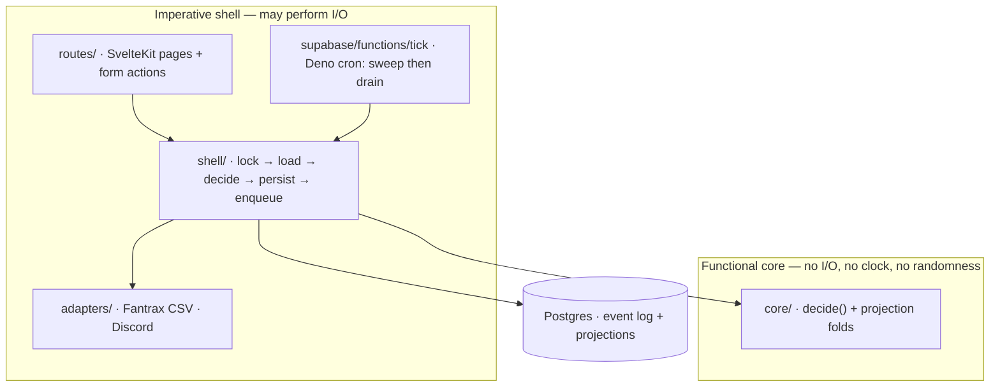
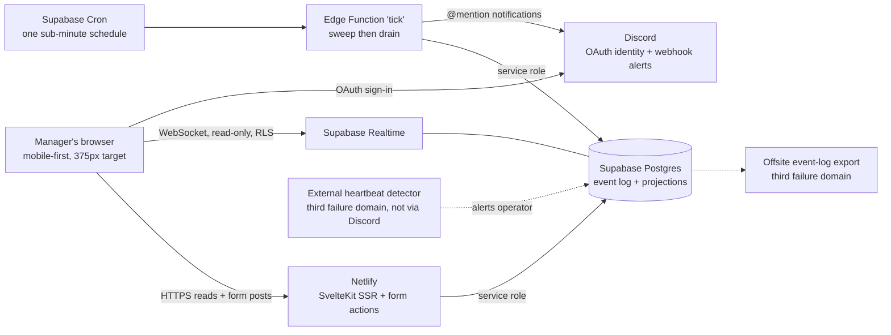
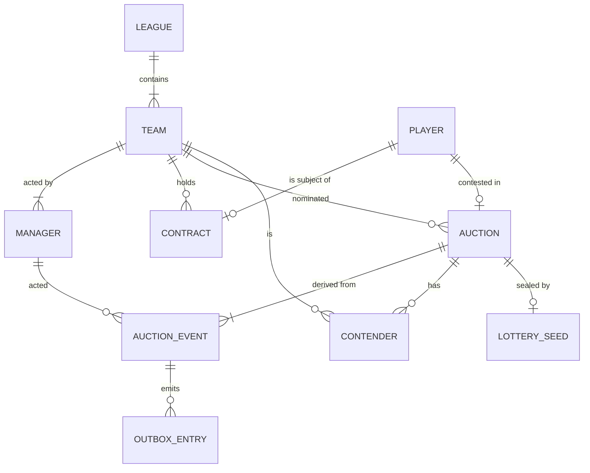
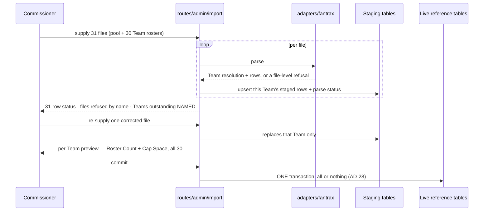

# Architecture Spine — BBSL Offseason Free Agent Auction

## Design Paradigm

**Functional core / imperative shell, with an event-sourced auction domain.**

Every auction rule — bid validity, increment, cap arithmetic, clock arithmetic, lottery resolution, slot placement — lives in a pure function that reads no clock, no database, and no random source. Everything that touches the world is a thin shell wrapped around it. *(The list named **Minors Exposure** until 2026-09-18; it is retired with FR-35 — see the note under AD-7.)*

The domain state is an append-only log of auction events. Current-state tables are a **projection** of that log, rebuilt in the same transaction that appends. The log is the truth; the tables are a fast read.

This is not a stylistic preference. PRD §5 says *"rule correctness is the product"* and *"scale is not a concern."* That inversion means the architecture buys determinism, reproducibility and auditability at the direct expense of throughput — and this paradigm is what makes those properties structural rather than aspirational.



Dependencies point one way only: **shell → core**. The core imports nothing from the shell, nothing from adapters, and nothing outside the TypeScript standard library. Any edge pointing out of `core/` is a defect.

## Invariants & Rules

### AD-1 — The rules core is pure

- **Binds:** all bid, nomination, clock, cap, lottery and slot-placement logic; FR-7 – FR-22, FR-28 *(FR-35 retired 2026-09-18)*
- **Prevents:** rules that cannot be tested without a database, a wall clock, or a live auction — and therefore are not tested, and therefore are wrong
- **Rule:** the core exposes two entry points and no others:
  - `evaluate(state, command, now) → GateResults` — the outcome of **every** gate the command must pass, each carrying `passed` and its own arithmetic. Total; it never refuses to answer. **The gate set is fixed per command type**, declared in `core/types.ts` — so a `PlaceBid` result always carries both `cap` and `slots` whether or not either passed, and a caller can never be handed a partial record it must guess at.
  - `decide(state, command, now, seed) → Accepted<Event[]> | Rejected<GateResults>` — authorises, and on refusal returns the *same* `GateResults` shape, so a refusal reports every gate that ran, not only the first that failed.

  Neither may call `Date.now()`, `Math.random()`, `fetch`, or any database client, nor import anything outside the TypeScript standard library. Server time and lottery seed are arguments. A rejection is a returned value, never a thrown exception. Iteration over any collection that can affect an outcome must be over an explicitly sorted sequence; no rule may depend on map, set or query-result ordering.
- **`decide()` obtains its gate outcomes by calling `evaluate()`** — never by re-deriving them. The read path calls `evaluate()` directly to disable controls with stated reasons and to render the Maximum Bid breakdown. **One evaluator, two consumers.** Two functions that must merely agree would be free to drift; one that the other calls cannot.

> The alternative — a singular `Rejected<reason>` with the view reconstructing the gate that passed — was rejected. `EXPERIENCE.md` reports *"Cap · Refused"* beside *"Slots · Passed — Roster Count would be 10 of 12"* on every refusal, and reconstructing that second line means a fragment of the Roster Capacity rule living outside `core/`. That is the second implementation of the cap arithmetic AD-2 exists to forbid.

### AD-2 — One rules core, one source location, two runtimes

- **Binds:** `src/lib/core/**`, the SvelteKit server routes, the Supabase Edge Function
- **Prevents:** an auction that closes under different rules than it bids under — the most dangerous divergence available in this design
- **Rule:** the core exists in exactly one directory imported by both the Node and Deno callers. It is never copied, re-implemented in SQL/PL-pgSQL, or forked per runtime. To keep that mechanically possible the core uses **explicit `.ts` import extensions and relative paths only** — no `$lib` aliases, no bare specifiers, no Node built-ins, no `process`. If an import cannot resolve under Deno, that is a defect in the core, never a licence to copy it.
- **The gate set is fixed per command type, and restoration is the second command type** (added 2026-09-08, FR-40). `RestoreLeadingBid` declares `{cap, slots}` and nothing else: increment, granularity, self-bid and contention were satisfied when the Bid was originally placed and are not re-litigated, while expiry and phase belong to the Close that triggered the cancellation. Declaring the narrower set in `core/types.ts` is what stops a restoration being implemented as a synthetic `PlaceBid` — which would re-run the increment rule against a price that has just fallen and refuse every restoration that mattered.
- **`RetractBid` is the fifth command type, and it declares neither `cap` nor `slots`** (added 2026-09-16, FR-15). `PlaceBid` was the first, `RestoreLeadingBid` the second, a Roster Trade the third and a Roster Move the fourth (AD-32). A retraction's gates are **ownership-and-standing** (the Team's own most recent Bid on this Auction, and it still stands — Leading Bid in Standard Contention, still in the Contender list in a lottery), **window** (ninety seconds from that Bid's own timestamp, pause-adjusted per AD-13), **cut-short** (the four figures against the baseline AD-31 records) and **phase**. The shortcut to forbid is the obvious one, because the command is bid-shaped: reusing `PlaceBid`'s gate set refuses retractions on **cap** grounds, which is nonsense — a retraction *releases* the retracting Team's capital and can breach nothing it holds. The restored Team's money and capacity gates are `RestoreLeadingBid`'s, already declared there and run by the shared restorer. This is the trap the bullet above describes, reached by a different command.

### AD-3 — Time is injected, never ambient

- **Binds:** every clock computation; FR-16 – FR-22, FR-34; NFR "server-authoritative time"
- **Prevents:** client clock skew changing a close time; the 24h/48h clock paths first being exercised in production; and a batch close silently backdating or postdating outcomes
- **Rule:** the current instant enters the core as a parameter, sourced from the database server's clock at transaction start. No layer below the shell reads a clock. The server persists and emits **absolute close timestamps**; clients render countdowns from them and never receive "seconds remaining." **In a close sweep, `now` for each auction is that auction's own nominal expiry, not the sweep's wall time** — a sweep running late must produce exactly the outcome an on-time sweep would have. Because time is a parameter, a full auction must be replayable against a synthetic clock at arbitrary speed; a time-compressed rehearsal against a fake 30-team league is a required capability, not an optional test.

### AD-4 — The auction domain is an append-only event log

- **Binds:** nominations, bids, closes, draws, phase transitions, overrides **including a Close Reversal (AD-33, added 2026-09-23)**; FR-32, FR-33; NFR §5 "Measurability"
- **Prevents:** an audit log maintained as a parallel system that drifts the first time someone forgets to write to it
- **Rule:** `auction_events` is insert-only; no `UPDATE` or `DELETE` is granted to any role, including the service role and the commissioner. FR-33's audit log is a read of this table, not a second table. Correcting anything — including FR-32's bid voiding — appends a compensating event and never mutates history. Every event carries a monotonic `seq` (database-assigned on insert), an `occurredAt`, a `schemaVersion`, a `coreVersion` (AD-24), the acting manager and team, and — because an insert-only log cannot be backfilled — the **measurement fields §5 requires**: device class on bid and nomination events, and dispatch plus delivery outcome on notification events. Imported reference data stays in ordinary mutable tables; **the world is not event-sourced, only the auction is.**

### AD-5 — Projections are derived, deterministic, and disposable

- **Binds:** all current-state tables read by the UI; FR-23 – FR-25, FR-39
- **Prevents:** the log and the tables disagreeing, and a corrupt projection becoming unrecoverable state
- **Rule:** projections are written only by folding events, inside the same transaction that appends them. **Folds are ordered by `seq`, never by `occurredAt`** — under AD-6 a transaction queued on the lock commits later while holding an earlier timestamp, so timestamp order and commit order differ. A full rebuild must be possible at any time and must be **deterministic given the same event log and the same reference-data snapshot**; because folds read mutable reference data (cap hits, eligibility flags, commissioner corrections), reference-data mutations are themselves recorded as events so a rebuild reproduces the world as it stood, not as it is now. A rebuild is idempotent: replaying `AuctionClosed` must converge on the same contract rows rather than duplicating them. *(Since 2026-09-23, "converge" means modulo the reversed-close set of AD-33: a reversed close yields no row however often it is replayed.)*

### AD-6 — One global write lock, one key

- **Binds:** every state-mutating transaction — bid, retraction, nomination, close, draw, override, phase change
- **Prevents:** the cross-auction cap breach that per-auction locking cannot see, and two callers each "taking the lock" while excluding nothing
- **Rule:** every mutating transaction calls `pg_advisory_xact_lock` **before reading any state**, and validates against what it reads under that lock. The lock argument is a **single named constant of one fixed arity**, defined once in `core/constants.ts` and used verbatim by every caller in both runtimes. Postgres' one-argument and two-argument advisory lock forms occupy **disjoint lock spaces** and do not exclude one another; mixing arities is a silent, total failure of this AD. Transaction-scoped, never session-scoped, so it survives Supavisor transaction-mode pooling.

> **This supersedes PRD §5's "Bid acceptance must be serialized per Auction," which is insufficient.** Maximum Bid depends on the bidding team's leading positions in *other* auctions, through **Committed Bids**. Two managers of one co-managed team bidding simultaneously on two *different* auctions each pass their own per-auction check and jointly breach the cap. No auction is raced — the *team* is. *(The argument named **Minors Exposure under FR-35** as a second cross-auction term until 2026-09-18. Losing it weakens nothing: Committed Bids alone is cross-auction, and since that date **every** lead feeds it where an eligible one used to feed nothing — so the race is if anything wider than when this AD was written.)*

### AD-7 — Derived money quantities are never stored, and are evaluated post-bid

- **Binds:** Available Cap Space, Committed Bids, Roster Reserve, Projected Active/Bench Additions, Reserve Additions, Maximum Bid, Roster Capacity; FR-12 – FR-14, FR-37

> **Amended 2026-09-18 (PRD tenth pass).** `Minors Exposure` and `Overflow Count` are **retired** from this list, with `Eligible Leading Bids` and `Active/Bench Overflow`. A Free Agent cannot be won into the minors, so every leading Bid commits its **full** amount for the life of its Auction and Committed Bids is the plain sum it was before them. **Minor League Eligibility is no longer an input to any derived money or capacity figure**, and it is *removed from* the bid and money state rather than defaulted, so no caller can reintroduce the dependency by passing a value. The four names remain in the code computing zero over an empty set; deleting them is a sweep, and **this AD is why that sweep is safe** — nothing stores them, so nothing has to be migrated when they go.
- **Prevents:** a cached exposure figure going stale the instant another team's bid changes it (addendum §D.4), and the pre-bid/post-bid ambiguity that flips §10 example 19
- **Rule:** these are computed by the core from committed state at validation time, on every evaluation, and may never be persisted on a team row, memoised across transactions, or cached client-side for validation. **They are evaluated against the hypothetical state that would exist if the prospective bid were accepted, not the state before it** — PRD FR-12 and the §3 Glossary both define Projected Active/Bench Additions as "counting the bid being placed" and "computed as though the prospective bid were already placed." A displayed figure is a rendering; only a freshly computed figure may authorise a bid.

> **Roster Capacity (FR-37) is a second, independent rejection ground, and both gates run on every evaluation.** A bid can be legal on money and illegal on slots, or the reverse; neither check subsumes the other, and a healthy Maximum Bid does not exempt a bid from capacity. The two are distinct machine-readable reasons carrying distinct arithmetic — reporting a capacity refusal as a cap refusal is a defect, because the manager's remedy differs. *(This read “**an unbounded** Maximum Bid under FR-35 does not exempt a bid from capacity” until 2026-09-18. There is no unbounded branch; the independence of the two gates is unchanged and is the whole point of the sentence.)*

- **The displayed Maximum Bid is `evaluate()` output on the read path.** CAP-10 requires it *persistently* visible and recomputed within one second of any Bid, Auction Close or override. It is therefore recomputed per viewer on every relevant projection change and never memoised across one — but it remains a rendering, and AD-29 governs what happens to it when the read path can no longer be trusted to be current.

### AD-8 — Money is integer dollars, pinned at every boundary

- **Binds:** every amount in the schema, the core, the adapters, and the wire format
- **Prevents:** floating-point drift deciding a $500,000 increment, and `int8` silently arriving as a string in one runtime and a number in the other
- **Rule:** `bigint` in Postgres, integer arithmetic in TypeScript, no floats, no decimal library, no cents. Because `int8` deserialises as `string` through node-postgres and as `number` through PostgREST, **every runtime boundary parses money explicitly into a branded integer type at the edge** — `"8500000" + 500000` must be impossible to write. The core accepts only the branded type.
- **Abbreviated rendering is a view concern and the export is not a view.** `DESIGN.md` renders money as `$14.5M` — always exactly one decimal, never dropped — which is lossless *only* because every BBSL figure sits on the $500,000 grid. That rendering is correct in the UI **and in Discord payloads**, which are a view of the same figures for the same readers. **It must never reach a CSV cell**, where it would silently corrupt the Fantrax round-trip: exports emit exact integer dollars (AD-24). One renderer, two permitted destinations, one forbidden one.
- **The grid is an invariant of every derived figure, not only of bids.** The one-decimal rendering is safe because every value sits on the $500,000 grid, so **any aggregate must land on it too** — and aggregates are where it is easiest to fall off. A conventional median across an even number of teams is the mean of the two middle values, which for 30 teams lands at $250,000 granularity and cannot be rendered at one decimal without lying. FR-39's League Median is therefore defined as the **lower** middle value, which is always a figure some real team holds. It lives in `core/money` as pure arithmetic on the branded type, **not** behind `evaluate()` or `decide()` — a read-model aggregate authorises nothing and is not a rule (AD-1). PRD §10 example 28 is its test.

### AD-9 — No client write path

- **Binds:** all mutations; NFR §5 "server-side against committed state, not against state the client held"; FR-13
- **Prevents:** Supabase's default ergonomics quietly creating the client-trusted path the PRD forbids
- **Rule:** no client-facing database role holds any `INSERT`, `UPDATE` or `DELETE` privilege on any table. The browser's key is read-only and used solely for Realtime subscriptions to projection tables. Every mutation goes through server-side code holding the service role. Client-side validation exists only to disable controls and pre-fill amounts; it is never the check that matters.

### AD-10 — Auction closes run off the web host, on one tick

- **Binds:** FR-21's 60-second close SLA; NFR "timer reliability"
- **Prevents:** a missed close silently extending an auction (the SM-1 failure), and a scheduled-work budget that exceeds the platform's quota
- **Rule:** a **single** Supabase Cron schedule invokes a **single** Edge Function that performs the close sweep and *then* drains the outbox, at a sub-minute interval. It never runs on Netlify and holds no in-memory timer. Overdue auctions are found by re-deriving what has expired, never by remembering what is pending, so the sweep is restart-safe by construction. The dev project's schedule is disabled by default and enabled only for a rehearsal.

> Two separate 10-second schedules would be ~518K invocations/month against Supabase free's 500K cap — which is shared org-wide with the dev project and the AD-3 rehearsal, and whose exhaustion stops the sweep **silently**. One combined tick is ~259K. The interval is chosen against the remaining headroom, not against the SLA alone.

- **"Single" governs the CLOSING schedule, not the count of rows in `cron.job`** *(amended 2026-09-14, on Story 7.9)*. Both reasons above are reasons about closing: two schedules that close would let two things close the same Auction and put AD-6's single-writer property in the hands of the advisory lock alone, and two *sub-minute* schedules would exhaust the invocation cap. Neither reason reaches a schedule that closes nothing. **A second schedule is permitted when it closes no Auction, takes no write lock, appends no event, and its invocation budget is negligible against the cap** — Story 7.9's `bbsl-fantrax-read` is the first and, at half-hourly spacing, costs ~1,440 invocations a month against 500K. It is forbidden to fold such work into the tick instead: AD-32 keeps the Fantrax read out of the close path precisely so a stranger's latency is never in front of an Auction closing, which is the same interest this AD protects, reached from the other side. **The bar for a further schedule is this paragraph's four conditions, not precedent** — a second *closing* schedule remains forbidden outright, and `scripts/verify-supabase.js` enforces the rule by NAMING the permitted jobs rather than counting them, so an unknown schedule still fails.

### AD-11 — Closes are sequential and deterministically ordered

- **Binds:** FR-21, FR-40, Slot Placement; §10 examples 31, 34 *(examples 16, 17, 20 and 35 retired 2026-09-18 — see the witness note below; FR-35 retired with them)*
- **Prevents:** a Team winning a thirteenth player because two lotteries were drawn against the same snapshot — and, until 2026-09-18, a batch sweep placing four eligible players into three Minor League Slots
- **Rule:** within one sweep pass, overdue auctions are closed **one at a time, in ascending nominal expiry time, ties broken by auction id**, and each close's effect on slot occupancy, Roster Count, Cap Hit **and any Bid Cancellations and restorations it causes (FR-40)** is committed to the state the *next* close is evaluated against. FR-21 requires exactly this — the Close evaluates the winning Team's remaining commitments **inside** the sequential ordering — so two Auctions closing in one sweep cannot both place a Player into the same last Slot.
- **The sweep proof needed a new witness on 2026-09-18, and that is worth recording rather than patching over.** This AD was demonstrated by **placement**: four eligible wins against three Minor League Slots came out differently batched than sequentially, so a snapshot bug showed up as a Player in the wrong Slot. **Placement can no longer tell the two shapes apart** — every win lands in Active/Bench, so a batched fold and a sequential one agree on where every Player goes. The proof now runs at a **capacity boundary**, where the batched closes **contradict each other outright**: two closes against one snapshot each see the last Free Active/Bench Slot and each take it, landing the Team on Roster Count 13, which FR-30 refuses to export. That is a **stronger** witness than the one it replaces — the old failure was a misplacement the league might have lived with, and this one is a state the product forbids.
- **This AD is what makes unlimited lottery participation safe** (added 2026-09-08, FR-18/FR-40). A Team with one open Slot may be a Contender in any number of Minimum-Bid Contentions, several of which can expire in the same sweep. Sequential closing means the first draw it wins fills its roster, the cancellation cascade removes it from the remainder, and the next draw runs over a Contender list that no longer contains it. Under a batched fold it would win two. The ordering was always correct; it is now load-bearing for a rule that did not exist when it was written, which is the strongest possible argument against relaxing it for throughput.

### AD-12 — Expiry is authoritative for validation

- **Binds:** FR-11, FR-13, FR-15, FR-16 – FR-21
- **Prevents:** a late bid stealing an auction the clock already decided
- **Rule:** an auction whose close time has passed is **closed for validation purposes from that instant**, regardless of whether the sweep has yet recorded the close. A bid arriving in the gap is refused as expired, not accepted and later reversed. Validation compares the injected `now` to the persisted absolute close time; it never reads a projection's "open" flag as authority. This makes a sweep stall produce *late* closes rather than *wrong* ones — the difference between an inconvenience and an SM-1 failure.
- **The draw closes the retraction window, and this AD already decides it** (added 2026-09-16, FR-15). An Auction past its close instant is closed for validation **from that instant**, so a retraction arriving after nominal expiry is refused on expiry whatever the ninety seconds say — and refused identically whether the retracting Team won or lost. This is reachable in exactly **one** place: a Minimum-Bid Contention, where a join does not reset the Clock (FR-18), so a Team joining at 08:59:30 against a 09:00 draw holds a window that **outlives the Auction** (§10 example 53). In Standard Contention it is unreachable, because a Bid resets the Clock to 24 hours. What is at stake is FR-20's auditability: a retraction accepted after the draw would unwind a result already published with the seed that produced it, which every Manager can reproduce by hand (AD-14) — the one outcome that auditability cannot survive. The **symmetry** is the point, and is why this is written down rather than left implicit: the same arithmetic that refuses a retraction one second late would have allowed it one second early, and the **server's** clock decides (AD-3), never the client's. **The test is against the Auction's close instant as it stands when the retraction arrives, never against the instant the retraction would restore.** A retraction restores the Clock value its Bid displaced, and that value is frequently **already past** — an Auction due to close at 09:00 that a Bid at 08:59:20 pushed to Wednesday closes at the next sweep once the Bid is taken back, which is exactly what would have happened had the Bid never been placed (§10 example 48). A unit that read this AD as refusing such a retraction would leave a Manager holding a Bid the rule says is retractable, and would do it precisely in the case the window exists for.

### AD-13 — Pause stores remaining duration, and halts the sweep

- **Binds:** FR-34, FR-15; every clock
- **Prevents:** a resume after an indeterminate outage silently resolving auctions that should still be open, a sweep closing auctions nobody could bid on, and a Retraction Window draining across a pause — taking a remedy away from a Manager who was locked out of using it
- **Rule:** pausing persists each running clock's *remaining duration* and the pause instant; resuming recomputes absolute close times forward from the resume instant. Absolute close times are never shifted in place. **The sweep checks paused state under the same lock and closes nothing while paused.** Pause and resume are events (AD-4) and are broadcast (FR-34). A **break-glass pause path independent of Netlify** must exist — a flag settable directly in the database — because FR-34 is the universal escape hatch and the web host is one of the things it must escape.
- **The Retraction Window is the first *derived* clock, and this AD's mechanism does not reach it** (added 2026-09-16, FR-15). Everything above works by **persisting** a running clock's remaining duration at pause. The Retraction Window has nothing to persist: FR-15 makes it **derived, never stored**, measured from its Bid's own timestamp. A builder applying this AD to the letter therefore finds no row to write, writes none, and the window **drains across the pause** — expiring while the Manager is locked out of acting on it, which is this product taking a remedy away from someone for a reason wholly outside their control. **Rule:** the window's elapsed time is `now − the Bid's occurredAt` **minus every paused interval intersecting that span**, folded from the pause and resume events this AD already appends. That keeps FR-15's promise — on resume the window holds exactly the time it held at pause, the same promise FR-34 makes every other Clock — with no stored countdown and nothing to schedule. **A retraction is a write, so it is refused while paused** like any other. The read path's live countdown is a rendering of this same derivation and is never cached, so a control that offers itself and a command that accepts it cannot disagree (AD-1, AD-29). **An open pause is an interval running to `now`** — the fold must not require a matching `Resumed` event to count one, or the window advances on wall-clock time through the whole outage and arrives at resume already expired, which is the precise harm this clause exists to prevent, reached by obeying it literally. **Ninety seconds is half-open:** the window is open while pause-adjusted elapsed time is **strictly less than** ninety seconds and closed at exactly `90.000s`, the same posture AD-12 takes on an Auction at its close instant. **One convention serves both** — AD-22's suppression is closed at exactly ninety seconds too, so a Bid at `90.000s` after a retraction earns its reset. Neither boundary, and no pause at all, was exercised by §10 examples 47–54; **§10 examples 56 (the pause) and 57 (both boundary halves) were added upstream to close that**, and FR-15 now carries the convention in its own text rather than only here.

### AD-14 — The randomizer is commit-reveal, and the seed is not in the log

- **Binds:** FR-20; SM-6
- **Prevents:** a commissioner-operated server appearing to choose a convenient seed after seeing the contender list — and, more concretely, a participant reading the seed early and joining only lotteries he would win
- **Rule:** when a Minimum-Bid Contention opens, a seed is generated and stored **outside the league-readable event log**, in a table no manager-facing role can read; only `hash(seed)` is published to the auction page, the audit log and Discord. At the draw, the seed is revealed and appended to the log alongside the ordered contender list and the selection. **Contender order is pinned to ascending join `seq`**, because it is an input to the winner. The seed→winner derivation is documented, deterministic, and reproducible by hand. A dissolved contention that never draws still reveals its seed at dissolution, so no unopened commitment is left behind.

> The builder of this app is also the commissioner and a competing manager. This AD is what makes that acceptable, and it fails completely if the seed is readable before the draw.

### AD-15 — Identity is Discord OAuth, bound server-side

- **Binds:** FR-4, FR-5, FR-6; UJ-3
- **Prevents:** a manager reassigning themselves to another team, and an email dependency the zero-budget constraint cannot support
- **Rule:** managers authenticate with **Discord OAuth** through Supabase Auth (`signInWithOAuth({ provider: 'discord' })`). No email is sent by this system for any purpose. Sign-in is restricted to Discord accounts the commissioner has pre-registered; no self-service registration exists (FR-4). The Manager→Team binding, the Commissioner flag and the Discord user id live in application tables written only by the commissioner and resolved server-side on every request. They are **never** read from JWT app-metadata or any claim the client can influence — Supabase's `updateUser` makes user metadata self-writable, so a metadata-based binding is self-assignable. Every event records the acting manager alongside the team (FR-5).
- **An unregistered account is refused without enumerating the league.** The refusal states only that the commissioner must add the account; it never reveals whether that Discord identity, or any team, exists in the league, and it offers no retry loop to probe with. **A session that expired is a distinct outcome from one that never existed** — sessions persist ≥30 days (AD-27), so expiry is rare enough to be disorienting and must say so rather than presenting as a fresh sign-out.

> This collapses two problems into one solution: authentication and the Manager→Discord-id mapping AD-18 needs for notifications are the same fact, obtained once. It also removes SMTP, its credentials, Supabase's 2/hour and 30/hour email traps, and an entire vendor.

### AD-16 — Read-side authorization and secret material

- **Binds:** FR-24, FR-25, FR-33; PRD §6 "no public/spectator access"
- **Prevents:** the Realtime read key exposing the league to the public, and pre-reveal seeds leaking through a permissive read policy
- **Rule:** every table carries an explicit row-level security policy; anonymous roles read **nothing**, and authentication is required for all data (PRD §6). Tables holding pre-reveal seeds are readable by **no** client-facing role at all. The service-role key, the Discord OAuth client secret and the Discord webhook URL are server-only environment variables and must never appear behind a `PUBLIC_`-prefixed name, which SvelteKit inlines into the client bundle.

### AD-17 — All outbound effects go through a transactional outbox

- **Binds:** FR-26, FR-27
- **Prevents:** a Discord delivery failure reversing an auction action; duplicate posts on retry; and a co-manager silently losing their copy of a required notice
- **Rule:** the transaction that appends events also inserts delivery intents. A separate dispatcher drains the outbox with retry and backoff, inside the same tick as the sweep (AD-10). Delivery never runs inside the auction transaction and can never fail it. The **idempotency key is `(event seq, channel, recipient)`** — keying on the event alone would deduplicate the second co-manager's mention, and FR-27 requires *both* managers of a co-managed team receive every team-affecting notice (SM-3 targets 100%).

### AD-18 — Discord is the only notification transport

- **Binds:** FR-26, FR-27; SM-3 (a *primary* success metric, target 100%)
- **Prevents:** a spike day silently dropping outbid notices, and the deliverability failure no free email tier avoids
- **Rule:** every notification is a Discord message in the league channel. A notice directed at a manager carries an **`@mention` of their Discord id**, which is what turns the league's public record into a personal push alert — the channel the PRD's own job-to-be-done calls "the channel I actually read." Muting (FR-27) is implemented as **posting the event without the mention**, so the public record stays complete while the ping is suppressed; outbid and phase notices are never mutable. Every outbound payload sets `allowed_mentions` explicitly, so no message can mass-ping the league by accident. The webhook limit is **30 requests/minute**, so the dispatcher batches multiple events into one message where it can and backs off on 429 — a sweep closing many auctions at once is the case that hits it.

> Chosen over email on a zero budget after checking the free tiers: Brevo gives 300/day but tests badly into Outlook/Hotmail and Yahoo, Mailjet caps ~200/day, SMTP2GO 1,000/month. A notification silently spam-foldered breaks SM-3 with no signal. Discord is free, unlimited at this volume, instant on mobile, and already required by FR-26.

### AD-19 — Liveness of the tick is monitored from outside both vendors

- **Binds:** AD-10, AD-17, NFR §5 availability; PRD §9 "timer misses fire"
- **Prevents:** a dead sweep being indistinguishable from a quiet 3am
- **Rule:** every tick writes a heartbeat row. A detector **outside both Netlify and Supabase, and not routed through Discord** — sharing no component with the outbox path it must report on (AD-27) — alerts the operator when the heartbeat goes stale, when the outbox backlog grows, or when a projection-integrity check disagrees with a rebuild. `pg_cron` → `pg_net` is fire-and-forget with no retry and no alert on a 5xx, and a paused or unhealthy project stops every schedule silently, so in-platform monitoring cannot discharge this. **Free-tier quota burn is monitored on the same footing as liveness**: Netlify credits (300/month; exhaustion pauses the site) and Supabase Edge invocations (500K/month, shared org-wide; exhaustion stops the tick) are both silent-outage sources, so both are alerted on well before the ceiling. The alert must reach a sleeping operator.

### AD-20 — Rule changes are versioned and fail-stopped during a live auction

- **Binds:** AD-2, AD-4; the whole Auction Phase
- **Prevents:** the two runtimes running different rule versions across a deploy window, producing un-rollbackable event corruption
- **Rule:** every event records the `coreVersion` that produced it (AD-4). The Node and Deno deployments carry the same version or the tick **refuses to run and alerts** rather than proceeding. Because AD-4 forbids deleting events, a bad rules deploy cannot be rolled back by reverting code — so any deploy touching `core/` during a live Auction Phase requires a pause (AD-13), the §10 suite green (AD-25), and a recorded reason.

### AD-21 — Durability is the architecture's job, and must be a restore path

- **Binds:** the whole event log and reference data; FR-26, FR-30, FR-33
- **Prevents:** total unrecoverable loss — the chosen Supabase free tier has **no automatic backups, no point-in-time recovery, and no SLA**
- **Rule:** the auction must be reconstructible from a store outside Supabase at all times. A scheduled export of the **event log and the reference data AD-5 needs to fold it** must run for the duration of the Auction Phase to storage in a third failure domain, and the restore must be **rehearsed at least once before the auction opens** — an untested restore is not a restore. FR-26's Discord channel is a corroborating human-readable record and a reconciliation aid, but a Discord *incoming webhook is write-only* and therefore is **not** a restore path on its own.

### AD-22 — The League Clock resets on nomination and valid bid, and nothing else

- **Binds:** FR-22, FR-15; §10 examples 13, 54
- **Prevents:** an event-fold that resets the phase clock on every event, extending the Auction Phase by up to 48 hours — and, since FR-15, a retract-and-rejoin stall extending it **without bound and at no cost**, which is a different failure class and the more dangerous one
- **Rule:** the League Clock is reset by exactly two event types — a Nomination and an accepted Bid (including a lottery join). Auction closes, randomizer draws, contention dissolutions, bid voids, **bid cancellations, restorations**, **bid retractions**, overrides, and pause/resume do **not** reset it. New event types default to *not* resetting it; extending the set requires changing this AD.
- **A cancellation resets nothing and removes nothing** (added 2026-09-08, FR-40). This is the sharpest distinction in the amendment and the one most likely to be built wrong, because `BidVoided` and `BidCancelled` both end a Bid's leadership and are one line apart in any reducer. A **void** removes that Bid's League Clock reset, because the Bid should never have counted — the clock recomputes *shorter*. A **cancellation** leaves the reset standing, because the Bid was entirely valid when placed and only its landing place disappeared — the clock does not move at all. A reducer that treats them alike will shorten the Auction Phase every time a roster fills, ending the auction early for reasons no manager can trace. The **Auction Clock** likewise is untouched by a cancellation where a Bid survives; where none survives, AD-31 governs and the clock is cleared rather than left running.
- **A retraction takes the void's treatment, and it is the third line in that neighbourhood** (added 2026-09-16, FR-15). `BidRetracted` **removes** the retracted Bid's League Clock reset and the Auction Phase recomputes **shorter** — exactly as `BidVoided` does, and exactly unlike `BidCancelled`, whose reset stands. A Bid the league agreed never counted did not buy the league another 48 hours. The bullet above warns that two of these are one line apart in any reducer; retraction is the **third**, and the likeliest of the three to be built wrong, because it resembles a **cancellation socially** — a Team's Bid goes away because that Team wanted it to — and a **void mechanically**. Nothing about who invoked it changes the fold.
- **A Bid placed by a Team within ninety seconds of that same Team's own retraction earns no reset** (added 2026-09-16, FR-15). This is the first rule in the product where an event **suppresses a different, later event's reset** rather than removing its own, so the fold can no longer decide *is this a reset?* from the Bid event alone — it must look back at the same Team's retraction history. It lives in `core/projection/league-clock.ts` beside the `BidVoided` case. **The ninety seconds run from the RETRACTION's own timestamp, not from the retracted Bid's** — the two anchors diverge on a late-window retraction (retract at `T+85s`, re-bid at `T+91s`: suppressed under the first reading, and not under the second), and only the first closes the stall. Under the Bid-anchored reading a Team simply retracts at the end of its window and re-bids past the original Bid's ninety seconds, earning a fresh reset every cycle — which is the stall this rule exists to close, reconstituted. **§10 example 54 does not discriminate the two readings** — it retracts 70s after the join and re-joins 10s later, which both readings suppress — so the anchor was pinned here first and **§10 example 55 was then added upstream to test it** (retract at `T+85s`, re-bid at `T+91s`). The suite now holds the anchor; this AD is no longer the only thing that does. **It is not a rate limit and must not be built as one.** It is the only thing standing between FR-15 and a Team holding the Auction Phase open **indefinitely and for free**: FR-18 resets the League Clock on every lottery join, the League Clock is the **sole** terminator of the Phase, and a retraction removes only its own reset — so joining a $1,000,000 lottery and retracting it every minute renews the only thing that ends the auction, at no cost and with no risk of ever winning anything. Before FR-15 the same stall was **bounded**, because every join was a commitment the Team kept and might have to honour. Built as a throttle — a cooldown, a per-minute cap, a disabled control — it would be tuned away by the first reader who takes it for anti-spam, and the stall returns. It is a clock rule and it belongs in the clock fold. §10 example 54 is its test.
- **An origin is not a reset** (added 2026-08-25, from Story 1.11). The clock's **origin** is the `AuctionOpened` event's own `occurredAt` — there is no League Clock during Setup, and FR-3 requires the open to start one at 48 hours. This does **not** widen the reset set to three: a reset can be unwound by a compensating `BidVoided`, whereas the open can never be unwound, so the origin is folded separately and no compensating event can move it. The expiry is therefore `LEAGUE_CLOCK` after the **later** of the origin and the latest surviving reset — which, before the first Nomination, is the origin alone. The default-not-resetting rule above is unchanged and still governs every event type that is not one of the two.
- **The League Clock is a fold, never a stored countdown.** It is derived as 48 hours from the latest surviving reset event, so a `BidVoided` compensating event removes that bid's reset and the clock recomputes shorter (FR-32, resolved from OQ-7 on 2026-08-17). Because AD-4 forbids deleting the original `BidPlaced`, the fold must treat a bid with a matching void as a non-reset rather than expecting the event to be gone. The recomputation is **prospective only**: if it lands the expiry in the past, the Auction Phase ends at the next tick evaluation and nothing accepted in the interim is invalidated — the same "late, not wrong" posture AD-12 takes on auction expiry. §10 example 27 is the case.

### AD-23 — Winning amount and Cap Hit are distinct fields

- **Binds:** FR-21, FR-30, FR-36, FR-41, FR-44 *(FR-35 retired 2026-09-18)*; §10 examples 38, 44, 45 *(16–18 retired the same day — the retired 16 still asserts this AD and is the reason it was kept rather than deleted)*
- **Prevents:** the two being conflated, which silently breaks both the cap arithmetic and the Fantrax export
- **Rule:** a Contract records the **winning amount** (the contract's value) and the **Cap Hit** (what it charges against the cap) as separate persisted fields. A Minor League placement yields a Cap Hit of `$0` while the winning amount stands unchanged. No code path may derive one from the other by inference. *(**Amended 2026-09-18, and the AD is *more* load-bearing than before, not less.** A Minor League placement no longer happens at a **Close** — every win lands in Active/Bench, where the two fields agree — so the inequality that used to demonstrate this AD arrives later, by **FR-44**'s Roster Move and **FR-41**'s re-placement. That is the danger: on every close the two fields now hold the **same number**, which is exactly the condition under which somebody collapses them into one, and the very next Move would then rewrite a Contract's value when it meant to change only what it charges. §10 example 44 is the case — a $0 becoming $3,000,000 and an $18,000,000 becoming $0 in one act, with neither value touched.)*

### AD-24 — Fantrax knowledge is confined to one adapter

- **Binds:** FR-1, FR-2, FR-30, FR-36
- **Prevents:** an export-format change between offseasons becoming a rewrite instead of a config edit
- **Rule:** CSV column names, header shapes and Fantrax-specific quirks appear in exactly one module; nothing outside it knows Fantrax exists. Rows join on the **stable Fantrax player ID, never on name**. The core receives parsed domain types and has no notion of a file. The export emits exact integer dollars, never the abbreviated view rendering (AD-8).
- **The import is thirty-one files, not two** (SPEC CAP-1, PRD FR-1/FR-3, corrected 2026-08-18): one Free Agent pool export plus **one roster export per Team**. The adapter resolves each file to exactly one of the 30 Teams and distinguishes **two refusal altitudes**: a *file* is refused by name when it matches no Team or a Team already supplied, and a *row* is refused by row when a column is missing, a Cap Space computes negative, or a starting state breaches a slot ceiling. Teams still outstanding are **named, never counted** — "3 files missing" is useless at 11am on setup day. Staging and promotion are AD-28.
- **Minor League Eligible is not a Fantrax concern.** The export does not carry it (OQ-2, resolved 2026-08-17); it is commissioner-set application data under FR-38, defaulting to *not* eligible. The adapter must never derive, infer, or fail on it. *(**Amended 2026-09-18.** This bullet continued: *because eligibility is mutable reference data that **cap arithmetic** folds against, each change is recorded as an event so AD-5's rebuild reproduces the flag as it stood.* **Cap arithmetic no longer folds against it at all** — it is not an input to any bidding-time rule. The event-sourcing requirement **stands on a narrower ground**: eligibility decides who may occupy a Minor League Slot under FR-44, so a rebuild must still reproduce the flag as it stood when a Move was recorded, or it will re-derive a Move the rules would now refuse.)*

### AD-25 — The §10 examples are the executable specification

- **Binds:** PRD §10 examples 1–57; NFR "rule correctness is the product"
- **Prevents:** the worked examples being read as documentation and quietly diverging from behaviour
- **Rule:** each of the 57 examples exists as a named test calling the core directly — no database, no HTTP, no clock mocking, no fixtures beyond a state literal. A rule change that alters any example's outcome must change the PRD in the same commit. **A **retired** example keeps its number, its file and its place in the suite** — it is not deleted, because a number freed is a number reused and a deleted test is behaviour nothing fails against; it asserts whatever outcome the surviving rules now produce, and says in its own header what it used to assert and why that stopped being true. **It also keeps every assertion that was load-bearing for something OTHER than the retired rule** — an input the example was built to distinguish must still be shown to be distinguishable, or retirement quietly destroys a guarantee the retired rule was merely the most visible consumer of. Retiring to the letter of the first sentence alone — a generic fixture asserting the new outcome — satisfies this AD's shape and loses that, which is why the second sentence is a rule and not advice. The suite must be green before any deploy to the production project. The two contradictions that previously blocked this AD were resolved in the PRD on 2026-08-17; examples 21 and 22 were added there to cover the eligible-player lottery, which had no worked case.
- **Examples 24–27 were added on 2026-08-17** when the commissioner's answers introduced new rules: 24 and 25 cover FR-37's Roster Capacity ceiling, 26 covers $500,000 granularity, 27 covers League Clock recomputation on a bid void. The same pass amended examples 18–20 (Team P moves to Roster Count 11, without which FR-37 contradicts example 20's outcome) and examples 2 and 10 (their refusals now also stand on granularity). Treat this as the standing demonstration of why this AD exists: a rule arriving after the examples were written silently invalidated one of them, and only re-deriving the arithmetic caught it.
- **Examples 29–35 were added on 2026-09-08** for the Outstanding Bid Allowance (FR-37) and Bid Cancellation (FR-40): 29 the allowance passing, 30 its precondition, 31 the cascade and a clean restoration, 32 a restoration skipped on re-validation, 33 a restoration with nothing surviving, 34 unlimited lotteries ended by one win, ~~35 the Minor-League trigger~~. *(**Example 35 was retired on 2026-09-18** and the distinction it existed to protect has lost its witness: every win now lands in Active/Bench and therefore raises Roster Count, so FR-40's trigger phrased as *“a close that reduces a free slot”* and one phrased as *“a close that increases Roster Count”* fire identically on every **Close**. **FR-40's wording should still not be narrowed** — a Roster Move or a Trade can still free or fill a Minor League Slot without touching the twelve — but no Close can demonstrate it any more, and an implementer reading only the closes would now find the two phrasings interchangeable. This is the second time this AD's lesson has run in the removal direction.)* The same pass rewrote 24 and 25 against the new ceiling.
- **Examples 36–43 were added on 2026-09-10** for Roster Trades (FR-41), Roster Divergence (FR-42) and Dead Money (FR-43). **Two of them are load-bearing as *pairs* rather than individually, which is new for this AD.** Examples **40 and 43** must move Maximum Bid in **opposite directions** — that is what stops *"a Drop lowers Maximum Bid"* being implemented as a flat rule when it is actually derived from the Cap Hit the Player was *charging*. A test that asserts either example alone passes while the rule is wrong; only the pair holds it. Examples **40 and 41** were the second pair — *see the 2026-09-16 entry below, which inverts it.* Unlike the 2026-08-17 and 2026-09-08 additions, **no existing example was invalidated by this pass** — the amendment adds rules rather than changing them.
- **Examples 44–46 were added on 2026-09-12** for the Roster Move (FR-44): 44 the one-act rearrangement after a Trade, 45 the Move that changes bidding power by spending Cap Space, 46 remembered eligibility. Example **45** was corrected the same day by Story 7.11 — its *before* figure omitted the Active/Bench Overflow term — which was this AD working as intended on an example only hours old. *(**Both the example and that correction were overtaken on 2026-09-18.** 45's conclusion **inverts**: the demotion it describes now **costs** $2,000,000 of Maximum Bid where it used to **buy** $10,000,000, because the Minors Exposure it released never existed. The Story 7.11 correction is **moot** with it — it turned on whether Active/Bench Overflow belonged in Projected Additions, and there is no overflow in either state now. The AD's lesson survives both times it fired.)*
- **Example 41 was RETIRED on 2026-09-16**, and this is the **first time this AD's lesson has run in the other direction.** Its three entries above all record the same failure — a rule **arriving** after the examples were written silently invalidated one. Here a rule was **removed**: FR-43's rookie-scale exception is gone, because the League waives Dead Money only in an amnesty period *before* the auction opens. **The removal failure mode is the worse of the two.** An arriving rule leaves an example computing the wrong answer and a test that goes **red**; a removed rule leaves an example computing an answer no rule produces and a test that stays **green against deleted behaviour**. Two consequences bind. **The 40/41 pair is inverted, not dropped:** it must now produce the **same** outcome, and it is the regression a reintroduced exception fails against — a stronger claim than the one it replaced, which merely checked that the two inputs differed. **The `2RK` designation still survives the import and now decides nothing**, so example 41's parse assertion is the only thing pinning that `2RK31` and `2031` stay distinguishable end to end — the distinction Story 7.6 built, which discharges this bullet's former *"red until the adapter is corrected"* note. Deleting the example would have left both claims unpinned and nothing to fail.
- **Examples 47–54 were added on 2026-09-16** for the retraction window (FR-15): 47 the typo the window exists for, 48 the retraction that closes the Auction immediately by restoring a Clock instant already past, 49 the change that cuts the window short beside the change that does not, 50 the Drop that closes the window by *freeing* a Slot, 51 leaving a lottery and emptying one, 52 the chain that terminates without a depth limit, 53 the window that outlived the Auction, 54 the stall the League Clock rule closes. **No existing example was invalidated** — FR-15 reversed a *prohibition*, and a prohibition had no worked examples to invalidate. That is the one thing making this the cheapest of the four amendment passes, and it will not hold if the retraction rules are later narrowed. Examples **49 and 50** are a **pair** in the sense the 2026-09-10 entry introduced: 49 moves the displaced Team's figures adversely by a **Bid**, 50 by a **Drop that gives that Team a Roster Slot**. A test that asserts 49 alone passes while the cut-short is implemented as the enumeration of bid-shaped acts FR-15 explicitly rejects; only 50 fails it. **Example 54 is not a clock test among others** — it is the only executable statement that the ninety-second suppression is not a rate limit (AD-22), and it is what a future reader has to break before removing it.
- **Examples 55–57 were added on 2026-09-16 by this spine's own binding pass, and the direction of travel is the point.** 55 pins the suppression **anchor** (retract at `T+85s`, re-bid at `T+91s` — the case 54 cannot discriminate, since it re-joins ten seconds after retracting and both readings suppress); 56 is the **pause**, which examples 47–54 never exercised despite FR-15 naming a drained window as its own harm; 57 is the **`90.000s` boundary**, both halves, which nothing pinned at all. **All three test rules the PRD stated and no example reached** — they were written because binding FR-15 to AD-13 and AD-22 forced the questions, and the amendment went upstream rather than being absorbed here. This inverts every prior entry in this AD: those record examples going **stale against arriving rules**, this one records examples being **added to catch rules that arrived without them**. The same day's gate also showed why the suite alone is not enough — the anchor had to be pinned in AD-22 *before* an example existed to test it, because the one example that touched the rule passed under both readings.
- **The suite is nine tests in arrears, and this AD is a requirement rather than a description** (added 2026-09-16). `tests/examples/` holds **45 files**: examples 47–57 have none, and **example 12 has none** — a pre-existing gap unrelated to this amendment, noticed on 2026-09-16 while advancing the counts, covering the unbid-nomination case that FR-40's cleared-clock decision leans on. The eleven new files are the **implementing stories'** to write, not this spine's to name: the Rule above already binds the whole range, and naming eight filenames is per-story detail one altitude below what this document fixes. The arrears are recorded because a spine that asserts 57 named tests exist while 45 files do is worse than one that says which **twelve** are owed. The trigger is the Rule's own last sentence — **the suite must be green before any deploy to production** — so the debt is discharged by the FR-15 stories and cannot outlive them. **The arrears grew from nine to twelve by this spine's own hand** — examples 55–57 exist because binding FR-15 found three rules nothing tested, which is the gate working rather than a regression, but it is debt all the same and it is counted here. If example 12 proves genuinely inexpressible as a state literal, this AD needs an exception clause naming it rather than a quietly missing file.

### AD-26 — Schema changes are migrations in the repository

- **Binds:** both Supabase projects
- **Prevents:** dev and prod diverging silently and surfacing it on setup day
- **Rule:** every schema change is a migration file committed to the repo and applied dev-first. Nothing is typed into the Supabase dashboard. The two projects — one freely wipeable dev, one production never touched by hand — exhaust the free tier's two-project cap; there is no third environment, which makes the discipline load-bearing rather than tidy. A migration applied while the tick is running must be safe against a concurrent sweep, or the tick is paused for the migration.

### AD-27 — Discord is a single point of failure and needs a break-glass path

- **Binds:** AD-15, AD-18; PRD §9 "solo-builder bus factor"
- **Prevents:** a Discord outage locking every manager out *and* silencing every alert at the same moment
- **Rule:** because Discord now carries both authentication and notification, its failure is total. Three mitigations are mandatory: (1) sessions persist ≥30 days (FR-4) so an outage does not log anyone out; (2) a **commissioner break-glass sign-in that does not depend on Discord** must exist, so FR-34's pause remains reachable when Discord is the thing that failed; (3) AD-19's liveness alert must not route through Discord, since it may need to report that Discord is down. A Discord outage lasting beyond the recovery threshold is a pause event, not a wait-and-see.

### AD-28 — The import is staged, then promoted in one transaction

- **Binds:** FR-1 – FR-3, SPEC CAP-1; `adapters/fantrax/`, `routes/admin/import`
- **Prevents:** a half-imported League existing as a reachable state, and thirty-one files being lost to a browser refresh at 11am on setup day
- **Rule:** parsed rows land in **staging tables**, never directly in the live reference tables. Team roster rows stage keyed by **Team**; the Free Agent pool stages too, as a single distinguished source keyed by **pool** — it is not exempt just because it has no Team, and re-supplying it replaces the pool alone. Per-file parse status persists between requests, so the import survives a refresh, a closed tab, or being picked up an hour later. Re-supplying one Team's file replaces **only that Team's staged rows**; the other twenty-nine are untouched. The per-Team preview of Roster Count and Cap Space reads staging. **Promotion is one transaction covering all thirty-one sources — all-or-nothing.** There is no partial commit and no resumable half-promotion.
- Re-import is permitted while the League is in Setup and refused once the auction opens (FR-1). The auction-open gate requires the pool import and **all thirty** Team imports promoted, plus every Team bound to a Manager, and **names** whatever is outstanding.

> Client-held-until-commit was considered and rejected: it needs no schema, but a flat battery loses all thirty-one files with thirty managers waiting. Setup day is high-stress and low-patience, and the durable option costs only a staging schema that is dropped after open.

### AD-29 — Read freshness is explicit, and stale money disables

- **Binds:** every projection read; the persistent Maximum Bid strip; the retract control (FR-15); CAP-10's 5-second board and 1-second recompute floors
- **Prevents:** the worst failure mode in this product — a stale board that still looks live, where a manager reads a figure, believes it current, and bids against it
- **Rule:** every projection read carries a **single global watermark — the highest event `seq` folded**, read from one source. Not a per-table stamp: the board and the Maximum Bid strip must never report different ages, and two units stamping their own tables would guarantee they do.
- The client derives exactly one of three states, from **connection status and a positive liveness check together**:

  | State | Condition | Obligation |
  | --- | --- | --- |
  | **Live** | channel `SUBSCRIBED` **and** the last liveness check succeeded within `FRESHNESS_WINDOW` | none — announcing "live" constantly is noise |
  | **Reconnecting** | channel reported `CHANNEL_ERROR`, `TIMED_OUT` or `CLOSED`, or one liveness check has lapsed | figures carry their age |
  | **Stale** | no successful liveness check within `STALE_WINDOW` | **bid and nomination controls disable with the reason stated**; Maximum Bid renders as a last-known figure, explicitly labelled |

  Both windows are named constants in `core/constants.ts`, not per-caller guesses.

> **A stalled watermark must never imply staleness.** This league runs as a relay of timezone clusters with long genuine silences — six quiet hours at 4am Pacific is a healthy auction, which is precisely why the League Clock is 48 hours. The liveness question is *"can I still reach the server?"*, never *"has anything changed?"*. A client that conflates the two disables bidding across every quiet stretch of the night. Liveness is therefore an explicit lightweight re-read of the watermark on an interval, not the absence of pushed messages.
>
> Connection status alone is also insufficient in the other direction: a channel can report `SUBSCRIBED` while delivering nothing ([supabase/realtime#1414](https://github.com/supabase/realtime/issues/1414) documents channels erroring after hours of running). The positive check is what closes that gap.

- In anything but Live, money either carries its age or the control it would authorise is disabled. **Countdowns are exempt** — they derive from absolute close timestamps the client already holds (AD-3), so freezing them on disconnect would invent a problem that does not exist.
- **The retract control HIDES where every other control disables, and its countdown is NOT exempt** (added 2026-09-16, FR-15). Two clauses above collide on it and both are right: this AD says a Stale client **disables** the control with the reason stated, while FR-15 says the retract control is **never shown disabled** — *"a control that sits there and fails on submit is worse than no control, because it is offered at the one moment a Manager has already made an expensive mistake."* The reconciliation is that **hiding discharges both**: the Manager is not offered something that will fail, and no stale figure authorises anything. So in **Stale** the control is absent and the freshness state says why, exactly as it is absent when the window has genuinely closed. **And the countdown exemption does not reach it.** An Auction's countdown is safe to run offline because its close instant is a fact the client already holds; a **Retraction Window can end early for a reason only the server knows** — the displaced Team's four figures moving (AD-31) — so a client counting down through a disconnect is showing time that may have stopped being real. That is the one countdown in this product which must degrade with the connection rather than through it.
- This changes nothing about authority. AD-9 already makes the server the only validator and AD-12 already refuses a bid on an expired auction whatever the client believed. **AD-29 makes the client's uncertainty visible instead of silent** — the SPEC's *"a displayed figure is a rendering; only a freshly computed figure authorises a Bid"* was true underneath and invisible on top.

### AD-30 — Phase and role gate the surface from one server-resolved source

- **Binds:** FR-6, CAP-2; every route guard and every navigation surface
- **Prevents:** two navigation surfaces offering different destinations, and a client-held phase copy outliving a transition
- **Rule:** the League phase — **Setup, Auction, Contract Assignment, Archived** — and the viewer's role resolve **server-side per request**, from the same application tables AD-15 binds identity to, and produce **one destination list**. `EXPERIENCE.md` renders that list twice (the persistent strip's sheet, and the header menu); they are one list drawn twice, never two lists kept in sync. A destination not live in the current phase is not rendered **and its route refuses server-side** — consistent with the standing rule that hiding UI is never the check.
- Phase transitions are events (AD-4) and the League Clock's expiry is a fold (AD-22), so **phase is a projection folded from the log — never a flag anyone sets by hand**. It obeys AD-5 like any other projection: rebuildable, and rebuilt to the same value. A commissioner cannot flip it directly; they append the event that causes it.

### AD-31 — A cancellation is compensating, records its own restoration, and shares one restorer with the void and the retraction

- **Binds:** FR-40, FR-32, FR-15; `core/rules/restore.ts`, `core/rules/close.ts`, `core/projection/auctions.ts`; AD-4, AD-5, AD-11, AD-14, AD-23; Stories 10.3, 10.4, 7.2
- **Prevents:** two divergent restoration implementations — one for the system, one for the Commissioner — and a fold that must re-run the gate suite over candidate bidders to learn who leads an Auction
- **Rule:** a cancellation appends **one** `BidCancelled` compensating event carrying the decision it made: the cancelled Bid's `seq`, the cause, and either the restored Team, Bid `seq` and amount, or `null` for an Auction returning to Awaiting Opening Bid. The original `BidPlaced` is **never** deleted or mutated and remains a history line. The projection **reads the recorded restoration** rather than re-deriving it — the same posture AD-14 takes recording a draw's result instead of re-running the randomizer, and AD-23 takes recording winning amount and Cap Hit as distinct fields instead of recomputing one from the other. The **decision** is made once, in a pure function over committed state; the **fold** is then a read.
- **One restorer, three callers, three parameters.** FR-40's cancellation and FR-32's void both end a Bid's leadership, restore a prior bidder, and re-commit that bidder's capital. They differ in exactly three ways, and each difference is a parameter rather than a different algorithm: a void **erases** its Bid from the fold while a cancellation **retains** it as history stripped of leadership; a void restores the **prior Auction Clock value** while a cancellation leaves the clock untouched; a void **removes** the Bid's League Clock reset (AD-22) while a cancellation leaves it standing. The shared part — walk the surviving history downward, re-evaluate `{cap, slots}` for each candidate under AD-2's `RestoreLeadingBid`, skip any Team that fails, stop at the first that passes — lives in **one** pure function in `core/rules/restore.ts` consumed by both. Two implementations would disagree about the skip rule, and the disagreement would surface only when a Commissioner voided a Bid on an Auction whose under-bidders had since filled their rosters — the worst possible moment to discover it. **FR-15's retraction is the third caller, and it passes the void's existing triple unchanged** (added 2026-09-16) — `erase`, `restore`, `remove`. There is **no fourth axis and no second selector**: the walk-down-and-skip already does everything FR-15 asks of it, and the parameters were named for a difference retraction happens to share rather than for the caller that first needed them. **FR-40's trigger bound is unchanged** — a retraction calls this restorer without being a cancellation and without causing one.
- **The Close is the sole appender, and the order within its transaction is fixed.** `close.ts` appends `AuctionClosed` **first**, then each `BidCancelled` it causes, in the order the cascade decided them (most recent commitment first). `restore.ts` **decides** and appends nothing; the Close embeds its answer in the event. Without this, two units each build half of a cancellation: the Close writes `BidCancelled` with a null restoration and the restorer writes a second event to fill it in, leaving a window in the log where an Auction has no leader and a replay that disagrees with what happened. One fact, one event, one writer.
- **A retraction is one `BidRetracted` event, appended by the retraction command itself** (added 2026-09-16, FR-15). Same shape and same reason as `BidCancelled`: the original `BidPlaced` is never deleted or mutated, and the event carries the retracted Bid's `seq` plus **one of three outcomes, not two**. **`Restored`** — the restored Team, Bid `seq`, amount and the Auction Clock instant being restored. **`Exhausted`** — the Auction returns to Awaiting Opening Bid and its Clock is **cleared**. **`ContentionContinues`** — the Team leaves the Contender list, there is no restoration because a lottery has no next-highest Bid, and the Auction Clock is **untouched** because the join never displaced one (FR-15, FR-18). The third case is the one `BidCancelled`'s two-case shape does not have a slot for, and it is **not** a variant of the second: both carry no restored Team, and a fold that read "no restoration" as `Exhausted` would **dissolve a live lottery that still has Contenders in it** — clearing the Clock and returning a contested Player to Awaiting Opening Bid. The outcome is therefore a **named discriminated case in the payload, never inferred from a null**. `BidCancelled` carries the same three cases for the same reason: a cancelled Contender leaving a surviving list is that event's third outcome too, and it has been latent since 2026-09-08 because no worked example reached it. The projection **reads the recorded restoration** rather than re-deriving it. One qualification, because the bullet above would otherwise be read too widely: *"the Close is the sole appender"* is a claim about **cancellations** — an ordering rule over a cascade — not a claim that nothing else may append a compensating event. A retraction has no cascade to order and appends its own event, in its own transaction under the AD-6 lock. **No migration:** `auction_events.event_type` is generic `text`, exactly as `BidCancelled` needed none.
- **Restoration is evaluated against post-close state.** The `{cap, slots}` re-evaluation of each candidate reads the state **after** the triggering Close's placement and after every cancellation already decided in this cascade — the same basis AD-11 hands the next Close. Handing the restorer the pre-close snapshot is the subtle version of this bug: it restores a Team that the close it is reacting to has just disqualified.
- **Where nothing survives, the Auction Clock is cleared, not left running.** An Auction with no Bid has no Clock (FR-17 starts it at the Opening Bid), so a restoration that exhausts the history returns the Auction to Awaiting Opening Bid with no close instant. Leaving the old clock running would close an Auction nobody is in, at an hour derived from a Bid that no longer leads.
- **On an exhausted contention the clock follows the withdrawal that emptied the list, not the one that started it** (added 2026-09-16, FR-15/FR-20). A Minimum-Bid Contention emptied of Contenders resolves **two different ways**, and both are correct: emptied by a **retraction** (or a void) the Clock is **cleared** and the Auction returns to Awaiting Opening Bid; emptied by a **cancellation** the Clock **keeps running** and the Auction closes at expiry with **no winner** and the Player back in the pool (FR-20). This is the `auctionClock` parameter doing exactly its job rather than an inconsistency — an erased Bid never counted, so the Clock it started never counted either, while a cancelled Bid stood and its Clock stands with it. **It is decided by the emptying act alone.** The Team that placed the Opening Bid holds no special status here: once others have joined, the Clock belongs to the contention rather than to the Team that started it (FR-15), so a contention opened by a Team that later retracts, and then emptied by a cancellation, **keeps its Clock**. A unit that resolved this by the Opening Bid's fate instead gets that case backwards, and an Auction with no Contenders and a running Clock is a state the commissioner has explicitly ruled out.
- **Cancellation is triggered only by a Close, and never by a restoration — and termination depends on it.** Each cancellation strictly reduces the Team's surviving commitments; a restoration that would breach the *restored* Team's own capacity is **skipped**, never accepted-then-cancelled. A design in which a restoration can trigger a cancellation is re-entrant, has no obvious bound, and must be rejected at review rather than fixed with a depth limit.
- **A retraction's chain terminates for a different reason, and both arguments must stand** (added 2026-09-16, FR-15). The bullet above bounds a **cascade inside one Close**; it says nothing whatever about a **human-invoked withdrawal**, which no system act triggers and which can therefore chain in a way re-entrancy arguments do not reach. FR-15's bound is different in kind: **every retraction is anchored to its own Bid's timestamp, and each step down the history is anchored to a strictly older Bid**, so a chain shortens by construction and cannot extend itself. The single sentence that makes it finite is that **being restored to leadership never hands a Team a fresh window** — a restored Bid's ninety seconds still run from when *it* was placed. §10 example 52 works it out to the step where the chain dies against a four-hour-old Bid. Neither argument subsumes the other and neither may be deleted in favour of the other; there are **two shapes of unboundedness here and one bound each**. Neither needs a depth limit, and a depth limit appearing in either path is the signal that the argument was not understood.
- **The one case that is forbidden rather than parameterised** (added 2026-09-16, FR-15/FR-19). The Bid that **dissolves** a Minimum-Bid Contention **cannot be retracted at all**. FR-19's conversion discards the Contender list and releases every Contender's $1,000,000 immediately; this selector walks to the next-highest **surviving Bid**, and a dissolved contention has none — only a discarded list of equal entries. Restoring it would be a genuine **fourth restoration shape**, and re-committing capital minutes later against Teams that were told the lottery was over and have stopped watching is precisely the harm FR-15 exists to avoid causing. So the **act** is forbidden instead: a converting Bid is **final on submission** and the retract control is **absent**, not disabled — FR-32's void stays the only remedy, as it was for every Bid before FR-15 existed. State it as a signal rather than a footnote: **an implementation that finds itself reaching for a fourth axis has mis-read the requirement.**
- **The trigger is a reduction in free Slots, of either kind** — Active/Bench or Minor League. A trigger written as "a Close that increases Roster Count" misses the Team at Roster Count 12 whose last Minor League Slot has just filled, and that Team can then win two more eligible lotteries (PRD §10 example 35).
- **The cut-short baseline is recorded on the displacing Bid, never reconstructed** (added 2026-09-16, FR-15). FR-15 closes the window the moment the displaced Team is **harder to restore than when it was displaced**, over four figures — Cap Space, Committed Bids, Roster Count, Minor League occupancy. That test needs those four **as of the instant of displacement**, and two readings of this spine would otherwise both be compliant and disagree: record them, or fold back to that `seq` and recompute them. **Recording wins, on two independent grounds.** Reconstructing the two roster-side figures means AD-32's snapshot-plus-forward-fold, which this spine already records as holed by an unrecorded out-of-band repair — so the cut-short would inherit a known-wrong input and fail as an arbitrary refusal or an arbitrary allowance no Manager could trace. And the read path renders the control as a **live countdown** (FR-15), so a replay-to-`seq` would run per viewer, per second, against a log that only grows. The displacing `BidPlaced` therefore carries the displaced Team's four figures at that instant, on the **post-acceptance** state AD-7 already evaluates against. An **Opening Bid displaces nobody** and a contention **join** displaces nobody, so neither carries a baseline — which is exactly why FR-15 gives both a full ninety seconds with no cut-short subject.
- **A recorded baseline is not a stored derived figure, and may never be read as one** (added 2026-09-16). AD-7 forbids Cap Space and Committed Bids being persisted on a team row, memoised across transactions, or cached for validation, and the clause above would read as a breach of it. It is not: a baseline in an immutable event payload is a **historical snapshot of one instant**, the same shape AD-32 writes as `capHitAfter` and `deadMoney` and AD-14 writes as a drawn result. The distinction has to be stated or it will be got wrong in one direction or the other. **The baseline authorises nothing.** It is only ever the *left-hand side* of a comparison whose right-hand side is computed fresh at retraction time, and no surface, gate or projection may source a current figure from it. AD-7 is unchanged.
- **No migration.** `auction_events.event_type` is a generic `text` column, so `BidCancelled` needs no schema change; AD-26 still governs any future column.

### AD-32 — The world changes by mutation plus record, and a world change refuses rather than cascades

- **Binds:** FR-41 – FR-44, CAP-22, CAP-23; `team_rosters`, `core/projection/contracts.ts`, `core/rules/roster-import.ts`, `core/rules/bidding.ts`, `adapters/fantrax/`; AD-4, AD-5, AD-6, AD-23, AD-24, AD-26, AD-31
- **Prevents:** a roster change that reaches the cap arithmetic but not the replay, a second implementation of the two bid gates, and a second trigger for Bid Cancellation
- **Rule:** a Roster Trade or Drop **mutates the reference tables and appends a record event in the same transaction**, under the global write lock (AD-6). AD-4 already says the world is not event-sourced — `team_rosters` is the world and stays a mutable table — but the record is not optional, and the reason is narrower than auditability: **every cap and slot figure in this product is a function of the rosters at a given instant.** A Trade that mutates the table without appearing in the log makes AD-5's rebuild, AD-21's restore and AD-3's synthetic-clock replay compute against today's rosters while folding yesterday's bids. The event therefore carries the **whole delta** — every Player, both Teams, and the Slot kind and Cap Hit on each side of the move — so a fold can reproduce the world as it stood, not merely learn that it changed. This is the same posture Story 7.3 takes for a Cap Space adjustment and FR-38 takes for eligibility, stated once here as the general rule.
- **Reconstruction folds; the live path does not.** AD-4's "not event-sourced" governs the **live write path only**: an ordinary read of a Team's roster reads `team_rosters`, and nothing rebuilds that table from the log. **AD-5's rebuild, AD-21's restore and AD-3's synthetic-clock replay are the exception, and they must never read the live table for a past instant.** They reconstruct roster state at a given `seq` by taking the last full reference-data snapshot — the one AD-21 already exports beside the log — and folding every reference-data-mutation event forward from it in `seq` order: `RosterMoveRecorded`, `RosterRearranged`, `DropRecorded`, the FR-38 eligibility events, and the FR-32 Cap Space adjustments. The reconstruction is **in-memory and read-only**: it never writes back to `team_rosters`, persists no table, and therefore produces no migration under AD-26. Without this clause a rebuild computes today's rosters against yesterday's bids — the precise failure the record event exists to prevent, arrived at by obeying AD-4 literally.
- **Two kinds of Contract, one event, two folding paths.** An Existing Contract is a `team_rosters` row and moves by `UPDATE` of `team_id` — **never delete-then-insert**, because `fantrax_player_id` is `not null unique` across every Team (`20260824020000_live_reference_tables.sql:46`). An Auction Contract is a **fold** (`core/projection/contracts.ts`) with no row to update, and moves only by the event. One `RosterMoveRecorded` event covers both; the shell applies the table half and `contractsReducer` folds the rest, under **latest-transfer-wins**, the discipline that module already applies to contract lengths. A Trade mixing both kinds is still one event and one transaction.
- **Only a settled Contract moves.** A Roster Trade or Drop names a Player who is currently the subject of a **settled Contract** — Existing or Auction. A Player **contested in an open Auction is not eligible**, and the refusal is a machine-readable rejection from the rules core, not a filter the admin UI is trusted to apply. He is neither kind of Contract yet: `contractsReducer` would have nothing to apply the transfer to, and the fold would carry a transfer for a Contract that only comes into existence at a later `AuctionClosed`. This is a **third refusal ground alongside the money and slots gates**, and it is checked first, because the other two are meaningless for a Player nobody holds.
- **A Roster Trade is a third command type, and a Roster Move a fourth.** AD-1 fixes the gate set **per command type** and AD-2 added `RestoreLeadingBid` as the second; a Trade is the third, declared in `core/types.ts` with its own gate set covering **both** Teams' post-Trade state. `bidding.ts`'s money and slot arithmetic is reused as **pure helper functions** — never by constructing a synthetic `PlaceBid` and force-passing the gates that do not apply. That shortcut is the very "second implementation" the next bullet forbids, and it would route two Teams' opposing deltas through a cap gate AD-7 defines as single-Team and incremental.
- **One evaluation, over the whole Trade, at the end.** The pure decision function receives the **entire** Trade — both directions, every Player — and evaluates both Teams once against post-Trade state. Evaluating a direction at a time refuses legal trades on states that never existed (§10 example 39). The function is total and returns a rejection as a value, like every other rule entry point (AD-1).
- **The gates are the existing gates.** Re-evaluation calls the same pure money and slots gates `core/rules/bidding.ts` already exposes. A Roster Trade must **not** carry its own affordability check: a second implementation would disagree with the first, and the disagreement would surface only when a Commissioner recorded a trade for a Team leading an Auction at its margin — the worst possible moment to discover it. This is AD-31's "one restorer, two callers" applied to the gates.
- **A world change refuses; it never cancels.** Where re-evaluation fails, the **whole Trade or Drop is refused** and nothing is written. **AD-31's trigger rule is unchanged and unextended: cancellation is caused by an Auction Close and by nothing else.** Permitting a Roster Trade to stand down a Bid would add a second trigger to a cascade AD-31 deliberately bounded, reopening the re-entrancy argument that AD closes, and would let a Commissioner's administrative act take a Player from a Team that did nothing. The Commissioner's remedy is FR-32's void or waiting for a Close — both already exist, both already record themselves.
- **Dead Money is a fourth `RosterSlotKind`, and it needs a migration.** It charges the Cap in full and counts toward no ceiling — structurally Injury Reserve without the ceiling of 2 — so `chargedCapHit` already returns the right value for it by falling through, and `SLOT_CEILINGS` gains an entry with no bound. **That fallthrough is sanctioned for `chargedCapHit` alone and is not a general pattern:** `RosterSlotKind` is a **closed union of exactly four members**, and every switch or match over it in `core/` and `adapters/` must be **exhaustive with no `default` case**, so a missing branch is a compile error rather than a sibling module silently tallying Dead Money as an Active/Bench occupant — which would contradict this AD's own "counts toward no ceiling" two clauses above. The migration adding the fourth check-constraint value lands in the same commit as the union's fourth member. `team_rosters_roster_slot_kind_check` enumerates exactly three kinds (`20260824020000_live_reference_tables.sql:61-62`), so admitting a fourth **is** a schema change and therefore a migration file applied dev-first (AD-26), never a dashboard edit. Contrast `BidCancelled`, which needed none because `auction_events.event_type` is generic `text`.
- **A reconstruction replays what the record SAYS, never what today's rules would decide** (added 2026-09-16). The forward fold two bullets above takes each event's payload **verbatim** — a `DropRecorded`'s own `deadMoney` and `removed`, a `RosterRearranged`'s own `capHitAfter` — and never recomputes them from the current rules. This is what "the event carries the whole delta so a fold can reproduce the world as it stood" already means, stated explicitly because it has become falsifiable: **events written before 2026-09-16 were decided under FR-43's since-removed rookie-scale exception**, and carry `removed: true` against a non-`$0` charge — an outcome no surviving rule produces. A fold that re-derived the amount would compute a *different* historical Cap Space from the one the League actually played under, and the two readings are equally compliant with every other word of this AD, which is why the choice is fixed here. The corollary binds harder than the rule: **a reconstruction is only ever as true as the record, so a world change absent from the log is invisible to it forever** — see the Deferred entry on out-of-band repair.
- **The Drop conversion reads the charge and nothing else** (added 2026-09-16, FR-43). The Dead Money one release carries is **`chargedCapHit` over the row, in one expression**. Nothing in the conversion branches on `RosterSlotKind`, on the rookie-scale round, or on the remaining term; **row removal is *derived* — the charge was `$0` — never decided.** A branch on `minor_league` would be a second spelling of "a Minor League row charges `$0`", which is the disagreement the bullet above forbids for the gates, reached by a different route. This is an `AD` rather than a comment because FR-43 **carried an exception until 2026-09-16** — a second-round rookie Contract of the current draft class cleared entirely — and the League may one day want a waiver back. The way back is a **new rule**, never a designation test reintroduced into the one expression that decides the amount. *(While it stood, that exception fired once in production and returned `$1,000,000` a Team should have kept charging.)* **`rookieScaleRound` stays parsed, persisted and carried in the `DropRecorded` payload**, and its retention is correct rather than drift: under AD-4 the log is immutable and events already written carry it, and AD-25's retired example 41 pins that it still survives the import. It must not be read by a later pass as an unused field to clean up.
- **A within-Team Move is the same machinery with one fewer Team and one more decision** (added 2026-09-12, FR-44). FR-44 changes no rule in this AD: mutation plus record, one transaction under the global lock, the whole delta in the event, the existing gates called rather than copied, refuse rather than cancel. Two things are genuinely new. **Placement comes from the command, not from `slotPlacementFor`** — FR-21's automatic rule is what a close and a Trade arrival apply, and a Move is a Manager deliberately overriding it; a Move that re-derived placement would silently undo itself. And **Minor League eligibility becomes a fold rather than a present-tense read.** "Sitting in a Minor League Slot is the eligibility statement" is sound while occupancy is only ever *read*, and unsound the moment an act can *empty* the slot: it would make every demotion irreversible, because the Slot was the only fact the app held. The eligible set is therefore the pool's flag **union every Minor League occupancy the log has ever carried**, reconstructed from the reference-data snapshot by the same forward fold this AD already specifies two bullets above — which is why FR-44 needs no column and no migration, and is the third instance of this AD's own lesson that **the record is not merely for audit**.
- **The Fantrax read is shell, adapter-confined, and writes nothing.** It runs outside the write lock and outside the core: the core reads no clock and no network (AD-1, AD-3), and a divergence is not a rule. Every field name and response shape stays inside `adapters/fantrax/` (AD-24), so a shape change between offseasons is one module. **A read produces a proposal and never an event, a row, or a projection.** That guarantee is **structural, not a naming convention**: the reader is a pure function that **never receives a database client as an argument**, so a write from inside it is a type error rather than a discipline someone has to remember. Only the calling shell code persists what the reader returns. Role separation would be the stronger control, as AD-9 gives the browser and AD-16 gives anonymous reads — but every server-side adapter here holds the one service role, including the Fantrax *importer*, which legitimately writes. Reader and importer therefore sit in one module under one credential, and the argument-shape rule is what keeps a future shared helper from quietly growing the write path this AD forbids.
- **The detector's failure mode is stated, not silent.** A reader that has stopped answering must render as *stopped*, never as *no divergences* (FR-42). This is the same reasoning AD-19 applies to the tick heartbeat: the dangerous state is not the outage, it is the outage that looks like health.

### AD-33 — A Close is reversed by a compensating event, and a reversal undoes exactly one thing

*(Added 2026-09-23 by `sprint-change-proposal-2026-09-23.md`: a Team won a Player it had room for only because a Contract sat in Injury Reserve against the league's free-agency rule, and nothing in the product could take a closed Auction's Player back.)*

- **Binds:** FR-32, FR-33; `core/projection/contracts.ts`, `core/projection/nominations.ts`, `core/rules/`; AD-4, AD-5, AD-6, AD-31, AD-32; PRD §10 example 58; Story 7.13
- **Prevents:** a Close undone by deleting or editing the log, a Contract that comes back when a reversed close is folded again, and a reversal that grows into cross-Auction surgery
- **Rule:** reversing a Close appends **one** `AuctionCloseReversed` naming the reversed close's `seq`. The Auction ends with no winner and the Player returns to the pool — **and that is all it does**. It does **not** unwind the FR-40 cancellations the Close caused, does **not** touch the League Clock, and does **not** reopen the Auction. Each of those would be a second rule meeting reality, and the league chose termination precisely so that none of them is needed (2026-09-23). The one other effect is bounded and recorded on the event: a Nomination Slot the Close released is re-held **only if the Team holds none now**.
- **Convergence is restated, not abandoned.** AD-5's *"replaying `AuctionClosed` must converge"* held under first-close-wins, and `contracts.ts` documented a second close for a Player as unreachable. A reversed Player can be nominated and won again, so that is no longer true. `contractsReducer` now keeps the set of **reversed close `seq`s**: a close in that set yields no Contract whatever order or multiplicity it is folded in, and a close not in it yields one as before. A Player holds at most one live Auction Contract at a time without the fold assuming he is only ever won once.
- **A reversal is a world change for the winning Team, and it refuses rather than cascades (AD-32).** It can only *free* capacity and cap, so it can trigger nothing — no cancellation, no restoration. It is refused, never adapted, when the Contract has since moved to another Team or been dropped; a Contract moved between Slots within its own Team is removed from wherever it now sits.
- **No migration.** `auction_events.event_type` is generic `text`. A re-held Nomination Slot's claim row is re-inserted into its existing table (`20260914000000_nomination_slot_released_on_win.sql`), inside the appending transaction, through the projection seam `server/nomination.ts` already uses.

## Consistency Conventions

| Concern | Convention |
| --- | --- |
| Domain vocabulary | PRD §3 glossary terms are the identifier names, verbatim and everywhere — `committedBids`, `rosterReserve`, `maximumBid`, `reserveAdditions`, `freeMinorLeagueSlots`, `rosterCapacity`, `minorLeagueEligible`. Introducing a synonym is a defect, per PRD §3. *(`minorsExposure` and `overflowCount` were on this list until 2026-09-18 and are retired; they survive in the code computing zero, and a reader must not take their presence as a live rule.)* |
| Events | Past-tense `PascalCase` (`BidPlaced`, `ContentionDissolved`, `AuctionClosed`, `BidVoided`). Ordered by `seq`, never by timestamp (AD-5). Every event carries `schemaVersion` and `coreVersion`. |
| Commands & results | Present-tense imperative (`PlaceBid`, `NominatePlayer`). A rule violation is a returned `Rejected` value carrying a machine-readable reason plus arithmetic components; thrown exceptions signal bugs only. |
| Money | Integer dollars end to end, branded at every runtime boundary (AD-8). Never a float, never an unparsed string, never formatted before the view. Rendered as `$14.5M` — **always exactly one decimal, never dropped** — which is lossless only on the $500,000 grid. Exports emit integers, never the rendering. |
| Naming | A three-letter capitalised abbreviation **always** means a player's real-life NBA team and never anything else. A fantasy Team is always spelled out plus the acting Manager — `Lakers — Meakel`. Every BBSL Team is named after an NBA franchise, so without this a Lakers manager bidding on a Laker prints `LAL` twice meaning two different entities. Holds in the UI, Discord payloads, the Audit Log and both exports. |
| Freshness | Every projection read carries the `seq` it was folded to (AD-29). No surface renders money without a freshness state attached. |
| Time | UTC instants, ISO-8601, absolute close timestamps only — never durations, never "seconds remaining." Local-timezone rendering is a view concern (FR-16). |
| Identifiers | Fantrax IDs for players and teams, carried unchanged import to export. Internal surrogate keys never leak into a CSV. |
| Database access | Reads may query projections directly. Writes go only through the transactional shell, which always takes the AD-6 lock first. |
| Authorisation | Commissioner capability is checked server-side on every administrative action, never by hiding UI (FR-6). The commissioner's own team is subject to every ordinary rule without exception. |
| Audit | Every commissioner override records actor, timestamp, before-state, after-state and a mandatory free-text reason (FR-32); no override path can skip the reason. Overrides and pauses are broadcast to Discord like any other event. |
| Accessibility | Auction state is never conveyed by colour alone — every state carries a word **and** a shape; a greyscale screenshot of any surface must remain fully readable, and that is the acceptance test. Touch targets ≥44×44px on all bidding and nomination controls (the bid control is specified at 46px). Contrast is **measured, not asserted**: `DESIGN.md` carries the ratio table, and two failures were corrected there before build. A disabled control always states its reason beside it — that is what makes the disabled token's low contrast legitimate. |
| Visual identity | `DESIGN.md` owns colour, type and component anatomy; `EXPERIENCE.md` owns behaviour, states and flows. **Where a mock disagrees with either, the spine wins** — and where either disagrees with an AD here, this document wins. No urgency design: no countdown pressure, no one-tap raise, no suggested bid amount. |
| Config | League constants ($165M cap, $1M minimum, $500k increment **and** granularity — one constant serves both, 24h, 48h, 12 Active/Bench Slots, 2 IR, 3 Minor League, allotment counts) and the AD-6 lock key are named values in `core/constants.ts`. No admin UI edits them (PRD §7.2). |

## Stack

Verified against primary sources 2026-08-17.

| Name | Version |
| --- | --- |
| SvelteKit | 2.70.2 — the 2.x stable line, **not** SvelteKit 3 (entered RC 2026-08-13) |
| `@sveltejs/adapter-netlify` | 6.0.4 stable, `edge: false` (Node functions). **Not** 7.0.0-next.0 |
| TypeScript | strict mode, `noUncheckedIndexedAccess` on |
| Node | **24 Active LTS** — Netlify Functions' documented default. Node 26 is the Current line and does not reach LTS until October 2026 |
| Deno | Supabase Edge runtime (the combined cron tick) |
| Postgres | Supabase-managed, ≥15.1.1.61 — required for sub-minute Supabase Cron |
| Supabase | Free tier ×2 projects (dev, prod); Auth (**Discord OAuth**), Realtime, Cron, Edge Functions |
| Netlify | Free tier. **Credit model** since 2026-04-14 — 300 credits/month; production deploys 15 credits, bandwidth 20/GB, compute 10/GB-hour, web requests 2/10,000. **Deploy previews and branch deploys cost 0**, so iteration is free and only promotion is metered. Projected auction-month burn ~130–160 credits |
| Discord | OAuth2 application (identity, AD-15) + incoming webhook (notifications, AD-18; write-only, 30 req/min) |
| Email | **None.** No email is sent by this system for any purpose |

## Structural Seed

### Deployment and environments



Two Supabase projects (dev, prod) and two Netlify contexts (deploy previews → dev, production branch → prod). The auction's most damaging failure — a missed close — depends only on the Supabase column, which is why AD-19's detector sits outside it.

### Core entities



`AUCTION_EVENT` is insert-only and ordered by `seq`; `AUCTION`, `CONTENDER` and the cap-facing views are projections of it (AD-4, AD-5). `LOTTERY_SEED` is readable by no client-facing role until reveal (AD-14). `CONTRACT` spans Existing Contracts (imported) and Auction Contracts (produced by a close), and carries winning amount and Cap Hit as separate fields (AD-23).

### Bid acceptance

```mermaid
sequenceDiagram
  participant M as Manager
  participant R as SvelteKit form action
  participant S as Transactional shell
  participant C as Pure core
  participant DB as Postgres

  M->>R: submit bid
  R->>S: PlaceBid command
  S->>DB: BEGIN; pg_advisory_xact_lock(LOCK_KEY)
  S->>DB: read events by seq + reference data; read now()
  Note over S,C: expired auctions are already closed<br/>for validation (AD-12)
  S->>C: decide(state, cmd, now, seed)
  Note over C: decide() calls evaluate();<br/>both gates run, neither short-circuits
  alt accepted
    C-->>S: Event[]
    S->>DB: append events, fold projections, enqueue outbox
    S->>DB: COMMIT
    S-->>M: accepted
  else rejected
    C-->>S: Rejected(GateResults)
    S->>DB: ROLLBACK
    S-->>M: refusal showing BOTH gates + full arithmetic
  end
```

The read path takes the shorter route — `evaluate()` alone, no lock, no transaction — to disable controls with stated reasons and render the Maximum Bid breakdown. It is the same function, so a control that says a bid is impossible and a refusal that explains why cannot disagree.

### Import



### The tick

```mermaid
sequenceDiagram
  participant CR as Supabase Cron
  participant T as Edge Function 'tick'
  participant S as Transactional shell
  participant C as Pure core
  participant OUT as Discord webhook

  CR->>T: sub-minute schedule
  T->>S: acquire LOCK_KEY, check paused (AD-13)
  S->>S: list overdue auctions, sort by expiry then id
  loop one auction at a time (AD-11)
    S->>C: decide(state, CloseAuction, auctionExpiry, seed)
    C-->>S: AuctionClosed / LotteryDrawn
    S->>S: fold projections; next close sees this occupancy
  end
  S->>S: write heartbeat (AD-19)
  T->>OUT: drain outbox by (seq, channel, recipient)
```

### Source tree

```text
bbsl-auction/
  src/
    lib/
      core/            # PURE — no I/O, no clock, no randomness, stdlib only,
                       # relative .ts imports only so Deno can load it (AD-2)
        rules/         # evaluate() -> GateResults; decide() -> Accepted | Rejected
                       # bidding, nomination, clocks, contention, allotment
        projection/    # event folds -> current state, ordered by seq
        money.ts       # branded integer-dollar type + parsers (AD-8)
        constants.ts   # league constants AND the AD-6 lock key
        types.ts       # commands, events, rejections, state
      shell/           # lock -> load -> decide -> persist -> enqueue
      adapters/
        fantrax/       # the ONLY module that knows CSV column names;
                       # 31-file import: pool + one per Team (AD-24, AD-28)
        discord/       # webhook posts + @mention payloads (allowed_mentions)
      server/          # supabase clients, Discord OAuth, service-role access
    routes/            # SvelteKit pages + form actions
  supabase/
    migrations/        # the only way schema changes (AD-26)
    functions/
      tick/            # ONE cron-invoked function: sweep then drain (AD-10)
  tests/
    examples/          # PRD §10 examples 1-57, one test each (AD-25)
```

## Capability → Architecture Map

| Capability / Area | Lives in | Governed by |
| --- | --- | --- |
| §4.1 Import & league setup (FR-1 – FR-3, FR-38; CAP-1, CAP-18) | `adapters/fantrax/`, `routes/admin/import`, `routes/admin/eligibility` | AD-24, **AD-28**, AD-8, AD-23, AD-26, AD-5 |
| §4.2 Identity, teams, roles (FR-4 – FR-6; CAP-2) | Supabase Auth (Discord OAuth), `server/auth`, `routes/` guards | AD-15, AD-16, AD-27, AD-9, **AD-30** |
| §4.3 Nomination (FR-7 – FR-10) | `core/rules/nomination`, `shell/` | AD-1, AD-4, AD-6, AD-22 |
| §4.4 Bidding, cap & roster enforcement (FR-11 – FR-15, FR-37, FR-44) | `core/rules/bidding`, `core/money` | AD-1, AD-2, AD-6, AD-7, AD-8, AD-12 |
| §4.4 Bid Retraction (FR-15) | `core/rules/retract`, `core/rules/restore`, `core/projection/league-clock`, `core/projection/auctions` | **AD-31**, **AD-22**, AD-2, AD-3, AD-4, AD-5, AD-12, AD-13 |
| §4.5 Clocks, contention, closing (FR-16 – FR-22) | `core/rules/clock`, `supabase/functions/tick` | AD-3, AD-10, AD-11, AD-12, AD-13, AD-14, AD-22 |
| §4.5 Bid Cancellation & restoration (FR-40) | `core/rules/restore`, `core/rules/close`, `core/projection/auctions` | **AD-31**, AD-2, AD-4, AD-5, AD-11, AD-14, AD-22, AD-23 |
| §4.6 The bid board & Your Positions (FR-23 – FR-25; CAP-10) | `routes/`, projections, Supabase Realtime | AD-5, AD-9, AD-16, AD-3, **AD-29**, **AD-30**, AD-7 |
| §4.6 Teams index & League Median (FR-39; CAP-20) | `routes/teams`, projections, `core/money` | AD-5, AD-7, AD-8, **AD-29**, **AD-30** |
| §4.7 Notifications (FR-26, FR-27) | `adapters/discord`, `functions/tick` | AD-17, AD-18, AD-27, AD-21 |
| §4.8 Contract assignment (FR-28, FR-29) | `core/rules/allotment`, `routes/team/contracts` | AD-1, AD-4, AD-23 |
| §4.9 Export to Fantrax (FR-30, FR-31, FR-36) | `adapters/fantrax/export`, `routes/admin/export` | AD-24, AD-8, AD-23 |
| §4.10 Commissioner controls & audit (FR-32 – FR-34) | `core/rules/override`, `routes/admin` | AD-4, AD-13, AD-15, AD-33, `Audit` convention |
| §4.10 Roster Trades, Drops & Moves (FR-41, FR-43, FR-44; CAP-22) | `core/rules/bidding` (gates reused), `core/rules/roster-act`, `core/rules/roster-import`, `core/projection/contracts`, `routes/admin` and one Manager-facing route, one migration (FR-43 only) | **AD-32**, AD-4, AD-5, AD-6, AD-23, AD-26, AD-31 |
| §4.10 Roster Divergence (FR-42; CAP-23) *(contingent)* | `adapters/fantrax/`, shell reader, `routes/admin` | **AD-32**, AD-24, AD-19, AD-1 |
| §5 Rule correctness | `tests/examples/` | AD-25, AD-1 |
| §5 Measurability (SM-3, SM-4) | event payloads | AD-4 |
| §5 Durability, availability, operations | export job, heartbeat detector | AD-19, AD-20, AD-21 |

## Conflicts to Resolve Upstream

Defects in the driving documents, not decisions this spine can make. **The two that blocked AD-25 were resolved in the PRD on 2026-08-17** and are retained here for traceability.

- **LIVE — FR-20 and FR-15 disagree about an emptied Contender list, and the disagreement is one word wide.** *(Found 2026-09-16 by this spine's own rules check; not reported upstream yet.)* FR-20 says a Contention whose list is empty at expiry — *"every Contender having been cancelled **or retracted**"* — closes with no winner at expiry. FR-15 says a list **emptied by retraction** returns the Auction to Awaiting Opening Bid with its **Clock cleared**, and says so deliberately, contrasting itself with the cancellation case in the same breath. Both cannot hold: under FR-15's outcome there is no expiry left to reach. The spine resolves it in FR-15's favour — the emptying act's own `auctionClock` treatment decides, per AD-31 — because that reading falls out of the erase/retain distinction the whole restorer is parameterised on, while FR-20's is a list that was widened without re-deriving the consequence. **The fix upstream is to strike *"or retracted"* from that FR-20 bullet and point it at FR-15**, which is a two-word edit. Flagged rather than silently implemented, because the spine is deciding which of two requirements is right and that is the PM's call to ratify.

- ~~**The Outstanding Bid Allowance was never recorded — a league rule missing from the PRD entirely.**~~ **APPLIED 2026-09-08**, upstream first: PRD FR-37 rewritten, FR-40 added, FR-11/14/15/18/20/21/35/39 amended, §10 examples 23–25 rewritten and 29–35 added; this spine then amended AD-2, AD-11, AD-22 and AD-25 and added **AD-31**. Not a defect this spine found — the commissioner reported it — but recorded here because it is the **third instance of the same lesson** the two entries below carry, and the most expensive: the rule was invisible through three requirements reviews, a full architecture pass, and five shipped epics, and became obvious the moment someone described how the auction is actually played. The first two instances were a screen nobody had specified and an import nobody had counted. *The pattern is not that reviews miss things; it is that reviews of a written rule cannot surface a rule that was never written down. Only narration does.* One structural consequence worth carrying forward: **`Overflow Count` split into two figures**, money-side and slots-side, and the two are one subtraction apart — see the PRD §9 risk, because a single implementation serving both is now wrong in a way no test announces.

- ~~**PRD §10 example 19 contradicts the §3 Glossary — BLOCKING.**~~ **RESOLVED 2026-08-17; MOOT 2026-09-18.** The Glossary's `M = 3 − currently occupied` was tested, found sound, and kept unchanged; examples 18–20 were the defect — a slip introduced when they were added during the FR-35 rewrite. Their setup was corrected to give Team P two occupied Minor League Slots (`M = 1`), the only value that made all three cohere. *(**All three examples were retired on 2026-09-18** with the rule they demonstrated, so the corrected setup governs nothing. The finding this spine should carry forward is the method, not the figure: when an example and a rule disagree, **test the rule first** — twice on this same arithmetic the rule was right and the example was the slip, and on the third occasion the rule itself was wrong and neither test would have caught it, because only the league could.)*
- ~~**A Minimum-Bid Contention on a Minor League Eligible player is governed by two contradictory rules.**~~ **RESOLVED 2026-08-17 in favour of FR-35 — and REVERSED 2026-09-18 in favour of FR-14.** *(Both retained: what makes this entry useful downstream is that it was settled twice.)* The 2026-08-17 resolution read: *such a contention is an Eligible Leading Bid of $1,000,000 feeding Minors Exposure, committing nothing while a Free Minor League Slot exists; the flat $1,000,000 of FR-14 applies only to contentions on Players who are not Minor League Eligible* — on the reasoning that a winning Contender lands in a Slot at a $0 Cap Hit. **That reasoning was the false step.** A Free Agent cannot be won into the minors: every win lands in an Active/Bench Slot at the full amount, and the $0 Cap Hit arrives only afterwards, by a Manager's own Roster Move under FR-44. **FR-14's flat $1,000,000 per Contender position is the whole rule again, with no eligibility branch**, and FR-35 is retired entire. Applied to the PRD in its tenth pass (2026-09-18), which also retired §10 examples 16–22, 25 and 35 and rewrote 38, 43 and 45. **The code led** — commit `7bb7a26` on `pilot` — because the old gates were permitting bids mid-auction that the league's rule forbids.
- ~~**FR-32's interaction with FR-22 is unspecified.**~~ **RESOLVED 2026-08-17 (OQ-7).** The League Clock **is** recomputed without the voided bid's reset, prospectively only. Applied to PRD FR-22 and FR-32, folded into AD-22, and worked as §10 example 27.
- ~~**PRD §5's "serialized per Auction" is superseded by AD-6.**~~ **APPLIED to the PRD 2026-08-17** — §5's concurrency NFR now requires global serialization and states why per-Auction is insufficient. PRD §5's Measurability NFR was also amended to note that append-only storage makes the SM-3/SM-4 fields uncapturable in hindsight (AD-4).
- ~~**FR-4 changes from magic-link email to Discord OAuth.**~~ **APPLIED to the PRD 2026-08-17**, including a Commissioner sign-in path independent of Discord (AD-27).
- ~~**FR-27 changes from email to Discord `@mention`.**~~ **APPLIED to the PRD 2026-08-17**, with the three mutable categories implemented as mention-or-no-mention so the public record stays complete. The PRD's risk register now carries the Discord single-point-of-failure and the "every Manager needs a Discord account" precondition.
- ~~**PRD §5's availability target is owned by no AD and is not achievable as stated.**~~ **APPLIED to the PRD 2026-08-17 (OQ-8).** The 99.8%-implying figure is gone; §5 now states a posture — outages must be survivable rather than decisive (AD-12 late-not-wrong, AD-13 pause, AD-21 restore) — with the >15-minute pause rule and the written recovery procedure as the actual requirements. No AD needs to own an uptime number, because there no longer is one.

- ~~**CAP-1 and FR-1/FR-3 assume a two-file import.**~~ **RESOLVED 2026-08-18.** Surfaced by UX journey work when the commissioner narrated opening night: the real Fantrax workflow produces **thirty-one** exports, one Free Agent pool plus one per Team. SPEC CAP-1, PRD FR-1 and PRD FR-3 were corrected in the same pass, and the correction is recorded in `SPEC.md`'s retired-assumptions note. Bound here as AD-28 and folded into AD-24. This is the clearest case yet for narrating a journey before building a screen — the defect was invisible in every requirements review and obvious the moment someone described their actual morning.

- ~~**The Teams index is named in the IA and specified nowhere.**~~ **RESOLVED 2026-08-18** as CAP-20 / FR-39, surfaced the same way as the import defect above — by the commissioner describing a screen he needed, after every requirements review had passed. It needs no new AD: it is a read over projections (AD-5) of figures never stored (AD-7), gated by phase and role (AD-30) and carrying its own freshness (AD-29). It did force one clarification into AD-8 — that the $500,000 grid binds aggregates too — and one deletion upstream: **CAP-10's own-team-only reservation on Free Minor League Slots and Minors Exposure, which was never enforceable**, since both are derivable from figures already published and a thirty-row index makes the subtraction free. Every team figure is now public except the per-Auction Maximum Bid. *Second instance of the same lesson: the defect was invisible in review and obvious the moment someone described the screen they wanted.*

**Two new rules arrived from the same 2026-08-17 answers and are now bound above, not open:** FR-37's Roster Capacity ceiling (folded into AD-7 as a second rejection ground) and FR-38's commissioner-set eligibility flag (folded into AD-24 and AD-5). Neither changes the shape of this spine — capacity is another pure function of committed state, and eligibility is another reference-data mutation recorded as an event.

## Deferred

- **Discord delivery shape.** AD-18 fixes the transport and the mention semantics but not whether notices are one message per event or batched, nor whether a bot (which can DM) is ever worth the extra setup over a webhook (which cannot). Decide at build time against the 30 req/min ceiling. **Revisit during the rehearsal**, which is when burst behaviour first becomes observable.
- **Outbox implementation.** Supabase Queues (pgmq) provides AD-17's semantics as a managed primitive and may be simpler than a hand-rolled table. Evaluate at build time; AD-17's contract is unchanged either way.
- **Archive reachability across the dormant year.** FR-31 requires an archived auction remain viewable "indefinitely," but a free-tier project pauses after a week of inactivity and this app idles ~11 months. Options: a paid month, a static export of final state, or accepting manual resume. **Revisit at archive time.**
- **The §5 outage recovery procedure.** The PRD requires a written procedure — how a >15-minute outage maps onto pause and a compensating clock adjustment — to exist *before the auction opens*. AD-13 provides the mechanism; the procedure is an operational document. Resolved 2026-08-17 (OQ-9) as **scheduled work inside the build epics** rather than an up-front deliverable. **Still blocking on auction open.**
- ~~**PRD open questions OQ-1 … OQ-6.**~~ **All nine PRD open questions were answered by the commissioner on 2026-08-17** and are recorded with their answers in PRD §11. OQ-1 proved larger than "an export validation": it became FR-37, a hard 12-slot ceiling that is a second rejection ground on every bid and that invalidated §10 example 20 until its setup was corrected. OQ-2 landed in `adapters/fantrax/` as predicted — by *removing* a column rather than mapping one. OQ-4 changed bid granularity from $100k to $500k, collapsing it onto the Minimum Increment.
- **Out-of-band repair, and whether the log is allowed to have a hole in it.** *(Raised 2026-09-16 by the FR-43 amendment; an `AD-33` candidate, deliberately **not** decided here.)* AD-32 says the world changes by **mutation plus record** — but it says it about acts taken *through this product*, and the clause above now pins that a reconstruction is only ever as true as the record. Neither covers a Commissioner reaching into a reference table directly with SQL, which is **exactly what has already happened**: the Drop that fired FR-43's since-removed exception was corrected by restoring the row as Dead Money **directly in production**, and that correction is recorded nowhere — no migration, no script, no event. So a snapshot-plus-fold reconstruction is wrong in *both* directions across that instant: it replays a removal the League no longer honours, and it has never heard of the repair. Latent, not live — no reconstruction module exists yet, which is the only reason no figure is wrong today. Options: make a corrective table write an event like any other world change (strongest, and what AD-32's own logic implies); re-snapshot after any manual repair so no fold crosses one (works, needs a stated procedure, does not stop the next unrecorded edit); or declare reconstruction best-effort before a cutover `seq` (cheapest, gives up AD-21's restore guarantee). **Decide before anything builds AD-32's reconstruction**, which is the moment the hazard stops being latent.
- **A second consumer of `removed` vs `reclassified`.** *(Raised 2026-09-16.)* The two are distinguishable today only because `contractsReducer` declines to fold `DropRecorded` at all — a won Contract cannot be dropped, so every release is a `team_rosters` row the same transaction mutates. The clause above fixes the *reconstruction* reading; a **new** consumer (FR-42's divergence detector is the likely first) would meet the question fresh, with no rule telling it whether a removed row and a `$0` Dead Money row are the same state. Decide when a second consumer appears, not before.
- **Fantrax API integration** (v2, PRD §7.2) — AD-24 keeps it contained. **Web push** (v2, §7.2) — AD-17's outbox is the seam a third transport plugs into. **Multi-tenancy** — rejected for v1 (§6); `core/constants.ts` is the only concession.
